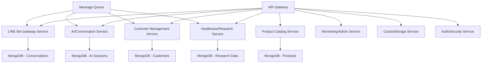

# LINE Bot Microservices Migration Plan

## 🎯 Executive Summary

**Current State**: Node.js Express monolith with modular service architecture  
**Target State**: 8 microservices with event-driven architecture  
**Migration Strategy**: Strangler Fig Pattern with gradual service extraction  
**Timeline**: 15-20 weeks (3.5-5 months)  
**Effort**: 460-660 hours  
**Risk Level**: Medium-High with comprehensive mitigation strategies

## 📊 Current Architecture Analysis

### Monolith Structure
```
src/
├── app.js (Express app with middleware)
├── server.js (Entry point)
├── routes/
│   ├── webhook.js (LINE Bot webhook)
│   └── api.js (REST API endpoints)
└── services/
    ├── aiService.js (AI provider coordination)
    ├── conversationService.js (Chat management)
    ├── customerService.js (User data)
    ├── productService.js (Product catalog)
    ├── healthcareService.js (Domain logic)
    ├── researchService.js (Web research)
    ├── lineBotService.js (LINE API integration)
    ├── cacheService.js (In-memory caching)
    ├── loggerService.js (Logging)
    └── monitoringService.js (Metrics)
```

### Current Dependencies
- **Database**: MongoDB with in-memory fallbacks
- **AI Providers**: DeepSeek + OpenRouter with failover
- **External APIs**: LINE Messaging API, Web search
- **Infrastructure**: Express.js, Docker, Vercel deployment

## 🏗️ Target Microservices Architecture

### Service Decomposition Strategy



### 1. LINE Bot Gateway Service
**Responsibility**: Webhook handling, request routing, LINE API integration
**Port**: 3001
**Database**: Conversations DB
**Dependencies**: Auth Service, Message Queue

```javascript
// Key Components
- Webhook request validation
- LINE signature verification
- Message routing to appropriate services
- Response aggregation and delivery
```

### 2. AI/Conversation Service
**Responsibility**: AI provider management, conversation logic, context management
**Port**: 3002
**Database**: AI Sessions DB
**Dependencies**: Cache Service, External AI APIs

```javascript
// Key Components
- Multi-provider AI orchestration (DeepSeek, OpenRouter)
- Conversation context management
- Response caching and optimization
- Fallback response handling
```

### 3. Customer Management Service
**Responsibility**: User data, preferences, analytics, purchase history
**Port**: 3003
**Database**: Customers DB
**Dependencies**: Auth Service, Analytics Queue

```javascript
// Key Components
- Customer profile management
- Preference tracking
- Purchase history
- User analytics and segmentation
```

### 4. Product Catalog Service
**Responsibility**: Product CRUD, category management, inventory
**Port**: 3004
**Database**: Products DB
**Dependencies**: Cache Service, Admin APIs

```javascript
// Key Components
- Product catalog management
- Category and filtering
- Multilingual product data
- Admin APIs for product management
```

### 5. Healthcare/Research Service
**Responsibility**: Domain-specific content, web research, knowledge base
**Port**: 3005
**Database**: Research Data DB
**Dependencies**: External APIs, Cache Service

```javascript
// Key Components
- Healthcare information processing
- Web research capabilities
- Content caching and optimization
- Domain-specific AI prompts
```

### 6. Monitoring/Admin Service
**Responsibility**: Metrics collection, logging aggregation, admin APIs
**Port**: 3006
**Database**: Metrics DB
**Dependencies**: All services for metrics collection

```javascript
// Key Components
- Centralized logging
- Metrics aggregation
- Health check coordination
- Admin dashboard APIs
```

### 7. Cache/Storage Service
**Responsibility**: Centralized caching, session storage, temporary data
**Port**: 3007
**Database**: Redis/In-memory
**Dependencies**: None (foundational service)

```javascript
// Key Components
- Distributed caching
- Session management
- Temporary data storage
- Cache invalidation strategies
```

### 8. Auth/Security Service
**Responsibility**: API key management, rate limiting, security middleware
**Port**: 3008
**Database**: Auth DB
**Dependencies**: None (foundational service)

```javascript
// Key Components
- API key validation
- Rate limiting coordination
- Security policy enforcement
- Admin authentication
```

## 🚀 Migration Phases

### Phase 1: Infrastructure Foundation (3-4 weeks)
**Objective**: Establish microservices infrastructure without breaking existing functionality

#### Week 1-2: Container & Gateway Setup
- [ ] Create Docker configurations for each service
- [ ] Set up API Gateway (NGINX or Kong)
- [ ] Configure service discovery (Consul or Docker Compose)
- [ ] Establish inter-service networking

#### Week 3-4: Database & Messaging
- [ ] Design database-per-service architecture
- [ ] Set up message queue (Redis Pub/Sub or RabbitMQ)
- [ ] Create data migration scripts
- [ ] Implement distributed caching strategy

**Deliverables**:
- Docker Compose orchestration
- API Gateway configuration
- Service discovery setup
- Database migration plan

### Phase 2: Core Service Extraction (6-8 weeks)
**Objective**: Extract services using Strangler Fig pattern while maintaining monolith

#### Week 5-6: Foundational Services
**Priority 1**: Cache/Storage Service & Auth/Security Service
- [ ] Extract caching logic into dedicated service
- [ ] Implement distributed cache with Redis
- [ ] Create authentication microservice
- [ ] Migrate API key validation

#### Week 7-8: Gateway & AI Services
**Priority 2**: LINE Bot Gateway & AI/Conversation Service
- [ ] Extract LINE webhook handling
- [ ] Implement message routing
- [ ] Migrate AI provider management
- [ ] Create conversation context service

#### Week 9-10: Business Logic Services
**Priority 3**: Customer Management & Product Catalog
- [ ] Extract customer data management
- [ ] Migrate product catalog logic
- [ ] Implement service-to-service communication
- [ ] Create API contracts and documentation

#### Week 11-12: Domain Services
**Priority 4**: Healthcare/Research & Monitoring Services
- [ ] Extract domain-specific logic
- [ ] Migrate research capabilities
- [ ] Implement centralized monitoring
- [ ] Create admin service APIs

**Deliverables**:
- 8 functional microservices
- Service communication patterns
- Data consistency mechanisms
- API documentation

### Phase 3: Integration & Optimization (4-5 weeks)
**Objective**: Ensure reliability, performance, and observability

#### Week 13-14: Testing & Reliability
- [ ] Implement end-to-end testing
- [ ] Create service health checks
- [ ] Set up distributed tracing
- [ ] Implement circuit breakers

#### Week 15-16: Performance & Monitoring
- [ ] Optimize inter-service communication
- [ ] Implement comprehensive monitoring
- [ ] Create alerting strategies
- [ ] Performance testing and tuning

#### Week 17: Documentation & Training
- [ ] Complete service documentation
- [ ] Create deployment guides
- [ ] Prepare rollback procedures
- [ ] Team training on new architecture

**Deliverables**:
- Comprehensive test suite
- Monitoring and alerting
- Performance benchmarks
- Operation runbooks

### Phase 4: Production Migration (2-3 weeks)
**Objective**: Safely migrate production traffic to microservices

#### Week 18-19: Gradual Migration
- [ ] Implement blue-green deployment
- [ ] Gradual traffic shifting (10%, 50%, 100%)
- [ ] Real-time monitoring and validation
- [ ] Performance comparison analysis

#### Week 20: Decommission & Cleanup
- [ ] Decommission monolith components
- [ ] Clean up legacy infrastructure
- [ ] Final performance validation
- [ ] Post-migration review

**Deliverables**:
- Production microservices deployment
- Performance validation report
- Migration lessons learned
- Updated operational procedures

## 💾 Data Migration Strategy

### Database-per-Service Design

```sql
-- LINE Bot Gateway Service
Database: conversations_db
Collections:
- conversations (lineUserId, messages[], status, metadata)
- webhook_events (eventId, timestamp, payload, status)

-- AI/Conversation Service
Database: ai_sessions_db
Collections:
- ai_sessions (sessionId, userId, context[], provider, metadata)
- ai_responses (responseId, sessionId, prompt, response, timestamp)

-- Customer Management Service
Database: customers_db
Collections:
- customers (lineUserId, profile, preferences[], createdAt)
- customer_analytics (userId, events[], metrics, aggregations)

-- Product Catalog Service
Database: products_db
Collections:
- products (productId, name, description, price, category, multilingual)
- categories (categoryId, name, description, products[])

-- Healthcare/Research Service
Database: research_db
Collections:
- research_cache (query, results[], timestamp, language)
- healthcare_data (topic, content, sources[], metadata)
```

### Migration Sequence
1. **Read Replica Setup**: Create read replicas for each service database
2. **Dual Write Pattern**: Write to both monolith and service databases
3. **Data Validation**: Ensure data consistency between systems
4. **Traffic Switching**: Gradually shift reads to service databases
5. **Cleanup**: Remove monolith database dependencies

## 🔄 Inter-Service Communication

### Synchronous Communication (REST APIs)
```javascript
// Service-to-Service API Calls
const customerService = {
  async getCustomer(lineUserId) {
    return await httpClient.get(`${CUSTOMER_SERVICE_URL}/customers/${lineUserId}`);
  },
  
  async updatePreferences(lineUserId, preferences) {
    return await httpClient.put(`${CUSTOMER_SERVICE_URL}/customers/${lineUserId}/preferences`, {
      preferences
    });
  }
};
```

### Asynchronous Communication (Message Queue)
```javascript
// Event-Driven Architecture
const messageQueue = {
  // Publish events
  async publishCustomerEvent(event) {
    await publisher.publish('customer.events', {
      type: event.type,
      userId: event.userId,
      data: event.data,
      timestamp: new Date()
    });
  },
  
  // Subscribe to events
  async subscribeToConversationEvents(handler) {
    await subscriber.subscribe('conversation.events', handler);
  }
};

// Example event types
const eventTypes = {
  CUSTOMER_CREATED: 'customer.created',
  CONVERSATION_STARTED: 'conversation.started',
  AI_RESPONSE_GENERATED: 'ai.response.generated',
  PRODUCT_VIEWED: 'product.viewed'
};
```

## 🐳 Docker Configuration

### API Gateway (NGINX)
```dockerfile
# nginx-gateway/Dockerfile
FROM nginx:alpine
COPY nginx.conf /etc/nginx/nginx.conf
COPY services.conf /etc/nginx/conf.d/default.conf
EXPOSE 80
```

### Service Template
```dockerfile
# services/[service-name]/Dockerfile
FROM node:18-alpine
WORKDIR /app
COPY package*.json ./
RUN npm ci --only=production
COPY . .
EXPOSE 3000
HEALTHCHECK --interval=30s --timeout=5s --retries=3 \
  CMD curl -f http://localhost:3000/health || exit 1
CMD ["node", "index.js"]
```

### Docker Compose Orchestration
```yaml
# docker-compose.microservices.yml
version: '3.8'

services:
  api-gateway:
    build: ./nginx-gateway
    ports:
      - "80:80"
    depends_on:
      - line-bot-gateway
      - ai-conversation
      - customer-management
      - product-catalog

  line-bot-gateway:
    build: ./services/line-bot-gateway
    ports:
      - "3001:3000"
    environment:
      - SERVICE_NAME=line-bot-gateway
      - DATABASE_URL=${CONVERSATIONS_DB_URL}
    depends_on:
      - conversations-db
      - redis

  ai-conversation:
    build: ./services/ai-conversation
    ports:
      - "3002:3000"
    environment:
      - SERVICE_NAME=ai-conversation
      - DATABASE_URL=${AI_SESSIONS_DB_URL}
      - DEEPSEEK_API_KEY=${DEEPSEEK_API_KEY}
      - OPENROUTER_API_KEY=${OPENROUTER_API_KEY}
    depends_on:
      - ai-sessions-db
      - redis

  # Additional services...

  # Databases
  conversations-db:
    image: mongo:latest
    volumes:
      - conversations_data:/data/db
    environment:
      - MONGO_INITDB_DATABASE=conversations

  ai-sessions-db:
    image: mongo:latest
    volumes:
      - ai_sessions_data:/data/db
    environment:
      - MONGO_INITDB_DATABASE=ai_sessions

  redis:
    image: redis:alpine
    volumes:
      - redis_data:/data

volumes:
  conversations_data:
  ai_sessions_data:
  customers_data:
  products_data:
  research_data:
  redis_data:
```

## 📊 Monitoring & Observability

### Health Checks
```javascript
// Health check endpoint for each service
app.get('/health', async (req, res) => {
  const health = {
    service: process.env.SERVICE_NAME,
    status: 'healthy',
    timestamp: new Date().toISOString(),
    version: process.env.npm_package_version,
    dependencies: {
      database: await checkDatabaseConnection(),
      cache: await checkCacheConnection(),
      externalAPIs: await checkExternalAPIs()
    }
  };
  
  const isHealthy = Object.values(health.dependencies).every(dep => dep.status === 'healthy');
  health.status = isHealthy ? 'healthy' : 'unhealthy';
  
  res.status(isHealthy ? 200 : 503).json(health);
});
```

### Distributed Tracing
```javascript
// Implement distributed tracing with correlation IDs
const tracing = {
  generateCorrelationId() {
    return `trace-${Date.now()}-${Math.random().toString(36).substr(2, 9)}`;
  },
  
  injectTraceHeaders(headers, correlationId) {
    return {
      ...headers,
      'x-correlation-id': correlationId,
      'x-trace-timestamp': new Date().toISOString()
    };
  },
  
  extractTraceInfo(req) {
    return {
      correlationId: req.headers['x-correlation-id'],
      traceTimestamp: req.headers['x-trace-timestamp']
    };
  }
};
```

## ⚠️ Risk Mitigation Strategies

### Data Consistency Risks
**Problem**: Distributed data across multiple services  
**Solution**: 
- Implement Saga pattern for distributed transactions
- Use eventual consistency with compensation actions
- Implement data validation and reconciliation jobs

### Service Communication Failures
**Problem**: Network failures between services  
**Solution**:
- Implement circuit breakers with hystrix
- Add retry mechanisms with exponential backoff
- Create fallback responses for critical paths

### Deployment Complexity
**Problem**: Coordinating deployments across 8 services  
**Solution**:
- Implement blue-green deployment strategy
- Use feature flags for gradual rollouts
- Create automated rollback procedures

### Performance Degradation
**Problem**: Increased latency due to service hops  
**Solution**:
- Implement response caching at API gateway
- Optimize database queries per service
- Use connection pooling and keep-alive

## 📈 Success Metrics

### Performance Metrics
- **Response Time**: <500ms for 95% of requests
- **Uptime**: 99.9% availability target
- **Throughput**: Handle current load + 50% capacity
- **Error Rate**: <0.1% for critical operations

### Business Metrics
- **Zero Data Loss**: During migration process
- **Feature Parity**: 100% functional equivalence
- **Development Velocity**: 30% improvement in feature delivery
- **Operational Efficiency**: 40% reduction in deployment time

## 🔄 Rollback Strategy

### Emergency Rollback Procedure
1. **Traffic Redirect**: Immediately redirect traffic back to monolith
2. **Data Sync**: Run data synchronization scripts
3. **Service Shutdown**: Gracefully shutdown microservices
4. **Validation**: Verify monolith functionality
5. **Investigation**: Analyze failure and plan remediation

### Gradual Rollback
1. **Service-by-Service**: Roll back individual services
2. **Feature Flags**: Disable specific service features
3. **Traffic Splitting**: Gradually reduce microservice traffic
4. **Data Migration**: Sync data back to monolith

## 📋 Implementation Checklist

### Infrastructure Setup
- [ ] Docker configurations for all services
- [ ] API Gateway setup and configuration
- [ ] Service discovery implementation
- [ ] Database-per-service design
- [ ] Message queue setup
- [ ] Monitoring and logging infrastructure

### Service Development
- [ ] LINE Bot Gateway Service
- [ ] AI/Conversation Service
- [ ] Customer Management Service
- [ ] Product Catalog Service
- [ ] Healthcare/Research Service
- [ ] Monitoring/Admin Service
- [ ] Cache/Storage Service
- [ ] Auth/Security Service

### Integration & Testing
- [ ] Service-to-service communication
- [ ] End-to-end testing suite
- [ ] Performance testing
- [ ] Security testing
- [ ] Disaster recovery testing

### Deployment & Migration
- [ ] CI/CD pipeline setup
- [ ] Blue-green deployment implementation
- [ ] Data migration scripts
- [ ] Rollback procedures
- [ ] Production monitoring

## 🎯 Next Steps

1. **Stakeholder Approval**: Get approval for timeline and resource allocation
2. **Team Assignment**: Assign developers to specific services and phases
3. **Infrastructure Setup**: Begin Phase 1 infrastructure preparation
4. **Detailed Planning**: Create detailed task breakdowns for each service
5. **Risk Assessment**: Conduct thorough risk analysis and mitigation planning

---

**Migration Lead**: Development Team  
**Timeline**: 15-20 weeks  
**Budget**: 460-660 hours of development effort  
**Success Criteria**: Zero downtime, feature parity, improved scalability