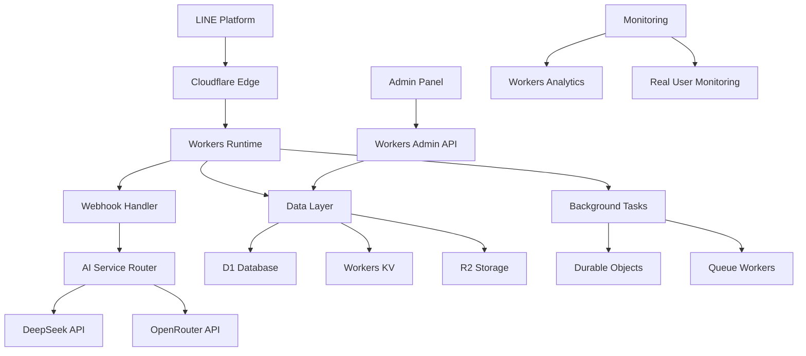

# LINE Chatbot Cloudflare Workers Architecture

## 🎯 Overview

This document outlines the comprehensive migration and optimization strategy for deploying the LINE chatbot server on Cloudflare Workers. The migration transforms the Express.js monolith into a high-performance, edge-distributed serverless application.

## 🏗️ Architecture Design

### Edge-First Architecture



### Service Boundaries

```
┌─────────────────────────────────────────────────────────────────┐
│                    Cloudflare Workers Edge                      │
├─────────────────────────────────────────────────────────────────┤
│  ┌─────────────────┐  ┌─────────────────┐  ┌─────────────────┐  │
│  │ Webhook Handler │  │   AI Router     │  │  Admin API      │  │
│  │   (Primary)     │  │  (Background)   │  │  (Secondary)    │  │
│  └─────────────────┘  └─────────────────┘  └─────────────────┘  │
├─────────────────────────────────────────────────────────────────┤
│  ┌─────────────────┐  ┌─────────────────┐  ┌─────────────────┐  │
│  │  D1 Database    │  │  Workers KV     │  │   R2 Storage    │  │
│  │  (Structured)   │  │   (Cache)       │  │    (Files)      │  │
│  └─────────────────┘  └─────────────────┘  └─────────────────┘  │
├─────────────────────────────────────────────────────────────────┤
│  ┌─────────────────┐  ┌─────────────────┐  ┌─────────────────┐  │
│  │ Durable Objects │  │  Queue Workers  │  │   Analytics     │  │
│  │   (Stateful)    │  │  (Async Tasks)  │  │  (Monitoring)   │  │
│  └─────────────────┘  └─────────────────┘  └─────────────────┘  │
└─────────────────────────────────────────────────────────────────┘
```

## 🔄 Migration Strategy

### Phase 1: Core Webhook Migration (Week 1-2)

#### 1.1 Workers Setup
```bash
# Initialize Cloudflare Workers project
npm create cloudflare@latest line-chatbot-workers
cd line-chatbot-workers

# Install dependencies
npm install @line/bot-sdk
npm install @cloudflare/ai
```

#### 1.2 Basic Webhook Handler
```javascript
// src/index.js
export default {
  async fetch(request, env, ctx) {
    const router = new Router();
    
    // LINE webhook endpoint
    router.post('/webhook', async (req) => {
      return await handleLineWebhook(req, env, ctx);
    });
    
    // Health check
    router.get('/health', () => {
      return new Response(JSON.stringify({
        status: 'healthy',
        timestamp: new Date().toISOString(),
        version: '1.0.0',
        edge: request.cf?.colo || 'unknown'
      }), {
        headers: { 'Content-Type': 'application/json' }
      });
    });
    
    return router.handle(request);
  }
};
```

### Phase 2: Data Layer Migration (Week 2-3)

#### 2.1 D1 Database Schema
```sql
-- schema.sql
CREATE TABLE customers (
  id TEXT PRIMARY KEY,
  line_user_id TEXT UNIQUE NOT NULL,
  display_name TEXT,
  language TEXT DEFAULT 'en',
  preferences TEXT, -- JSON string
  analytics TEXT,   -- JSON string
  created_at DATETIME DEFAULT CURRENT_TIMESTAMP,
  updated_at DATETIME DEFAULT CURRENT_TIMESTAMP
);

CREATE TABLE conversations (
  id TEXT PRIMARY KEY,
  line_user_id TEXT NOT NULL,
  status TEXT DEFAULT 'active',
  language TEXT DEFAULT 'en',
  session_start DATETIME DEFAULT CURRENT_TIMESTAMP,
  last_activity DATETIME DEFAULT CURRENT_TIMESTAMP,
  message_count INTEGER DEFAULT 0,
  metadata TEXT, -- JSON string
  FOREIGN KEY (line_user_id) REFERENCES customers (line_user_id)
);

CREATE TABLE messages (
  id TEXT PRIMARY KEY,
  conversation_id TEXT NOT NULL,
  role TEXT NOT NULL, -- 'user', 'assistant', 'system'
  content TEXT NOT NULL,
  intent TEXT,
  sentiment TEXT,
  confidence REAL,
  timestamp DATETIME DEFAULT CURRENT_TIMESTAMP,
  metadata TEXT, -- JSON string
  FOREIGN KEY (conversation_id) REFERENCES conversations (id)
);

CREATE TABLE products (
  id TEXT PRIMARY KEY,
  name TEXT NOT NULL,
  description TEXT,
  price REAL,
  currency TEXT DEFAULT 'THB',
  category TEXT,
  subcategory TEXT,
  specifications TEXT, -- JSON string
  multilingual TEXT,   -- JSON string
  availability TEXT,   -- JSON string
  analytics TEXT,      -- JSON string
  status TEXT DEFAULT 'active',
  created_at DATETIME DEFAULT CURRENT_TIMESTAMP,
  updated_at DATETIME DEFAULT CURRENT_TIMESTAMP
);

CREATE TABLE ai_sessions (
  id TEXT PRIMARY KEY,
  line_user_id TEXT NOT NULL,
  provider TEXT NOT NULL,
  session_data TEXT, -- JSON string
  context TEXT,      -- JSON string
  status TEXT DEFAULT 'active',
  created_at DATETIME DEFAULT CURRENT_TIMESTAMP,
  updated_at DATETIME DEFAULT CURRENT_TIMESTAMP
);

-- Indexes for performance
CREATE INDEX idx_customers_line_user_id ON customers (line_user_id);
CREATE INDEX idx_conversations_line_user_id ON conversations (line_user_id);
CREATE INDEX idx_conversations_status ON conversations (status);
CREATE INDEX idx_messages_conversation_id ON messages (conversation_id);
CREATE INDEX idx_messages_timestamp ON messages (timestamp);
CREATE INDEX idx_products_category ON products (category);
CREATE INDEX idx_products_status ON products (status);
CREATE INDEX idx_ai_sessions_line_user_id ON ai_sessions (line_user_id);
```

#### 2.2 Data Access Layer
```javascript
// src/services/database.js
export class DatabaseService {
  constructor(env) {
    this.db = env.DB;
    this.kv = env.KV;
  }
  
  // Customer operations
  async getCustomer(lineUserId) {
    const customer = await this.db.prepare(
      'SELECT * FROM customers WHERE line_user_id = ?'
    ).bind(lineUserId).first();
    
    if (customer) {
      return {
        ...customer,
        preferences: JSON.parse(customer.preferences || '[]'),
        analytics: JSON.parse(customer.analytics || '{}')
      };
    }
    
    return null;
  }
  
  async createCustomer(customerData) {
    const id = crypto.randomUUID();
    const now = new Date().toISOString();
    
    await this.db.prepare(`
      INSERT INTO customers (id, line_user_id, display_name, language, preferences, analytics, created_at, updated_at)
      VALUES (?, ?, ?, ?, ?, ?, ?, ?)
    `).bind(
      id,
      customerData.lineUserId,
      customerData.displayName || 'Customer',
      customerData.language || 'en',
      JSON.stringify(customerData.preferences || []),
      JSON.stringify(customerData.analytics || {}),
      now,
      now
    ).run();
    
    return await this.getCustomer(customerData.lineUserId);
  }
  
  async updateCustomer(lineUserId, updates) {
    const updateFields = [];
    const values = [];
    
    if (updates.displayName !== undefined) {
      updateFields.push('display_name = ?');
      values.push(updates.displayName);
    }
    
    if (updates.language !== undefined) {
      updateFields.push('language = ?');
      values.push(updates.language);
    }
    
    if (updates.preferences !== undefined) {
      updateFields.push('preferences = ?');
      values.push(JSON.stringify(updates.preferences));
    }
    
    if (updates.analytics !== undefined) {
      updateFields.push('analytics = ?');
      values.push(JSON.stringify(updates.analytics));
    }
    
    updateFields.push('updated_at = ?');
    values.push(new Date().toISOString());
    
    values.push(lineUserId);
    
    await this.db.prepare(`
      UPDATE customers SET ${updateFields.join(', ')} WHERE line_user_id = ?
    `).bind(...values).run();
    
    return await this.getCustomer(lineUserId);
  }
  
  // Conversation operations
  async getActiveConversation(lineUserId) {
    const conversation = await this.db.prepare(`
      SELECT * FROM conversations 
      WHERE line_user_id = ? AND status = 'active'
      ORDER BY last_activity DESC LIMIT 1
    `).bind(lineUserId).first();
    
    if (conversation) {
      return {
        ...conversation,
        metadata: JSON.parse(conversation.metadata || '{}')
      };
    }
    
    return null;
  }
  
  async createConversation(lineUserId, language = 'en') {
    const id = crypto.randomUUID();
    const now = new Date().toISOString();
    
    await this.db.prepare(`
      INSERT INTO conversations (id, line_user_id, status, language, session_start, last_activity, message_count, metadata)
      VALUES (?, ?, 'active', ?, ?, ?, 0, '{}')
    `).bind(id, lineUserId, language, now, now).run();
    
    return await this.getActiveConversation(lineUserId);
  }
  
  async addMessage(conversationId, role, content, metadata = {}) {
    const messageId = crypto.randomUUID();
    const now = new Date().toISOString();
    
    // Insert message
    await this.db.prepare(`
      INSERT INTO messages (id, conversation_id, role, content, intent, sentiment, confidence, timestamp, metadata)
      VALUES (?, ?, ?, ?, ?, ?, ?, ?, ?)
    `).bind(
      messageId,
      conversationId,
      role,
      content,
      metadata.intent || null,
      metadata.sentiment || null,
      metadata.confidence || null,
      now,
      JSON.stringify(metadata)
    ).run();
    
    // Update conversation
    await this.db.prepare(`
      UPDATE conversations 
      SET last_activity = ?, message_count = message_count + 1
      WHERE id = ?
    `).bind(now, conversationId).run();
    
    return messageId;
  }
  
  async getConversationHistory(lineUserId, limit = 10) {
    const messages = await this.db.prepare(`
      SELECT m.* FROM messages m
      JOIN conversations c ON m.conversation_id = c.id
      WHERE c.line_user_id = ? AND c.status = 'active'
      ORDER BY m.timestamp DESC LIMIT ?
    `).bind(lineUserId, limit).all();
    
    return messages.results.map(msg => ({
      ...msg,
      metadata: JSON.parse(msg.metadata || '{}')
    })).reverse();
  }
  
  // Product operations
  async searchProducts(query, options = {}) {
    let sql = 'SELECT * FROM products WHERE status = "active"';
    const params = [];
    
    if (query) {
      sql += ' AND (name LIKE ? OR description LIKE ? OR category LIKE ?)';
      const searchTerm = `%${query}%`;
      params.push(searchTerm, searchTerm, searchTerm);
    }
    
    if (options.category) {
      sql += ' AND category = ?';
      params.push(options.category);
    }
    
    sql += ' ORDER BY name LIMIT ?';
    params.push(options.limit || 10);
    
    const products = await this.db.prepare(sql).bind(...params).all();
    
    return products.results.map(product => ({
      ...product,
      specifications: JSON.parse(product.specifications || '{}'),
      multilingual: JSON.parse(product.multilingual || '{}'),
      availability: JSON.parse(product.availability || '{}'),
      analytics: JSON.parse(product.analytics || '{}')
    }));
  }
  
  async getProduct(productId) {
    const product = await this.db.prepare(
      'SELECT * FROM products WHERE id = ? AND status = "active"'
    ).bind(productId).first();
    
    if (product) {
      return {
        ...product,
        specifications: JSON.parse(product.specifications || '{}'),
        multilingual: JSON.parse(product.multilingual || '{}'),
        availability: JSON.parse(product.availability || '{}'),
        analytics: JSON.parse(product.analytics || '{}')
      };
    }
    
    return null;
  }
  
  // Cache operations using Workers KV
  async getCachedResponse(key) {
    try {
      const cached = await this.kv.get(key, 'json');
      return cached;
    } catch (error) {
      console.error('Cache get error:', error);
      return null;
    }
  }
  
  async setCachedResponse(key, value, ttl = 3600) {
    try {
      await this.kv.put(key, JSON.stringify(value), {
        expirationTtl: ttl
      });
    } catch (error) {
      console.error('Cache set error:', error);
    }
  }
  
  async deleteCachedResponse(key) {
    try {
      await this.kv.delete(key);
    } catch (error) {
      console.error('Cache delete error:', error);
    }
  }
}
```

### Phase 3: AI Service Integration (Week 3-4)

#### 3.1 AI Service Router
```javascript
// src/services/ai.js
export class AIService {
  constructor(env) {
    this.env = env;
    this.database = new DatabaseService(env);
  }
  
  async generateResponse(lineUserId, message, context = {}) {
    const cacheKey = `ai:${context.language || 'en'}:${this.hashMessage(message)}`;
    
    // Check cache first
    const cached = await this.database.getCachedResponse(cacheKey);
    if (cached) {
      return {
        ...cached,
        source: 'cache'
      };
    }
    
    // Get user context
    const customer = await this.database.getCustomer(lineUserId);
    const conversationHistory = await this.database.getConversationHistory(lineUserId, 5);
    
    // Build enhanced context
    const enhancedContext = {
      ...context,
      customer: customer ? {
        preferences: customer.preferences,
        language: customer.language
      } : null,
      history: conversationHistory.map(msg => ({
        role: msg.role,
        content: msg.content
      }))
    };
    
    // Try primary AI provider (DeepSeek)
    try {
      const response = await this.callDeepSeek(message, enhancedContext);
      
      // Cache successful response
      await this.database.setCachedResponse(cacheKey, response, 3600);
      
      return response;
    } catch (error) {
      console.error('DeepSeek API error:', error);
      
      // Fallback to OpenRouter
      try {
        const response = await this.callOpenRouter(message, enhancedContext);
        
        // Cache fallback response with shorter TTL
        await this.database.setCachedResponse(cacheKey, response, 1800);
        
        return response;
      } catch (fallbackError) {
        console.error('OpenRouter fallback error:', fallbackError);
        
        // Return static fallback
        return {
          response: "I'm having trouble processing your request right now. Please try again later.",
          provider: 'fallback',
          confidence: 0.1,
          intent: 'error_fallback'
        };
      }
    }
  }
  
  async callDeepSeek(message, context) {
    const response = await fetch(this.env.DEEPSEEK_API_ENDPOINT || 'https://api.deepseek.com/v1/chat/completions', {
      method: 'POST',
      headers: {
        'Content-Type': 'application/json',
        'Authorization': `Bearer ${this.env.DEEPSEEK_API_KEY}`
      },
      body: JSON.stringify({
        model: this.env.DEEPSEEK_API_MODEL || 'deepseek-chat',
        messages: this.buildMessages(message, context),
        max_tokens: parseInt(this.env.DEEPSEEK_MAX_TOKENS || '2000'),
        temperature: 0.7
      })
    });
    
    if (!response.ok) {
      throw new Error(`DeepSeek API error: ${response.status}`);
    }
    
    const data = await response.json();
    const aiResponse = data.choices[0]?.message?.content || '';
    
    return {
      response: aiResponse,
      provider: 'deepseek',
      tokensUsed: data.usage?.total_tokens || 0,
      confidence: 0.9,
      intent: this.extractIntent(message),
      processingTime: Date.now() - performance.now()
    };
  }
  
  async callOpenRouter(message, context) {
    const response = await fetch('https://openrouter.ai/api/v1/chat/completions', {
      method: 'POST',
      headers: {
        'Content-Type': 'application/json',
        'Authorization': `Bearer ${this.env.OPENROUTER_API_KEY}`,
        'HTTP-Referer': 'https://line-chatbot.workers.dev',
        'X-Title': 'LINE Chatbot'
      },
      body: JSON.stringify({
        model: this.env.OPENROUTER_MODEL || 'deepseek/deepseek-r1-0528:free',
        messages: this.buildMessages(message, context),
        max_tokens: parseInt(this.env.DEEPSEEK_MAX_TOKENS || '2000'),
        temperature: 0.7
      })
    });
    
    if (!response.ok) {
      throw new Error(`OpenRouter API error: ${response.status}`);
    }
    
    const data = await response.json();
    const aiResponse = data.choices[0]?.message?.content || '';
    
    return {
      response: aiResponse,
      provider: 'openrouter',
      tokensUsed: data.usage?.total_tokens || 0,
      confidence: 0.8,
      intent: this.extractIntent(message),
      processingTime: Date.now() - performance.now()
    };
  }
  
  buildMessages(message, context) {
    const messages = [
      {
        role: 'system',
        content: this.buildSystemPrompt(context)
      }
    ];
    
    // Add conversation history
    if (context.history && context.history.length > 0) {
      messages.push(...context.history);
    }
    
    // Add current message
    messages.push({
      role: 'user',
      content: message
    });
    
    return messages;
  }
  
  buildSystemPrompt(context) {
    let prompt = `You are a helpful assistant for a LINE chatbot that provides customer support, product information, and healthcare guidance.`;
    
    if (context.customer) {
      prompt += ` The user prefers ${context.customer.language || 'English'} language.`;
      
      if (context.customer.preferences && context.customer.preferences.length > 0) {
        prompt += ` Their interests include: ${context.customer.preferences.join(', ')}.`;
      }
    }
    
    prompt += ` Always respond in a helpful, friendly manner. Keep responses concise but informative.`;
    
    return prompt;
  }
  
  extractIntent(message) {
    const lowerMessage = message.toLowerCase();
    
    if (lowerMessage.includes('product') || lowerMessage.includes('buy') || lowerMessage.includes('purchase')) {
      return 'product_inquiry';
    } else if (lowerMessage.includes('health') || lowerMessage.includes('medical') || lowerMessage.includes('doctor')) {
      return 'health_inquiry';
    } else if (lowerMessage.includes('hello') || lowerMessage.includes('hi') || lowerMessage.includes('สวัสดี')) {
      return 'greeting';
    } else if (lowerMessage.includes('help') || lowerMessage.includes('support') || lowerMessage.includes('ช่วย')) {
      return 'help_request';
    } else {
      return 'general_inquiry';
    }
  }
  
  hashMessage(message) {
    // Simple hash for caching (could use crypto.subtle.digest for better hashing)
    let hash = 0;
    for (let i = 0; i < message.length; i++) {
      const char = message.charCodeAt(i);
      hash = ((hash << 5) - hash) + char;
      hash = hash & hash; // Convert to 32-bit integer
    }
    return Math.abs(hash).toString(36);
  }
}
```

### Phase 4: LINE Integration (Week 4-5)

#### 4.1 Webhook Handler
```javascript
// src/handlers/webhook.js
import { AIService } from '../services/ai.js';
import { DatabaseService } from '../services/database.js';

export class WebhookHandler {
  constructor(env) {
    this.env = env;
    this.database = new DatabaseService(env);
    this.aiService = new AIService(env);
    this.lineConfig = {
      channelAccessToken: env.CHANNEL_ACCESS_TOKEN,
      channelSecret: env.CHANNEL_SECRET
    };
  }
  
  async handle(request) {
    // Verify LINE signature
    const signature = request.headers.get('x-line-signature');
    const body = await request.text();
    
    if (!this.verifySignature(body, signature)) {
      return new Response('Unauthorized', { status: 401 });
    }
    
    const events = JSON.parse(body).events;
    
    // Process events in parallel
    const promises = events.map(event => this.handleEvent(event));
    await Promise.all(promises);
    
    return new Response('OK', { status: 200 });
  }
  
  async handleEvent(event) {
    try {
      switch (event.type) {
        case 'message':
          await this.handleMessage(event);
          break;
        case 'follow':
          await this.handleFollow(event);
          break;
        case 'unfollow':
          await this.handleUnfollow(event);
          break;
        default:
          console.log(`Unhandled event type: ${event.type}`);
      }
    } catch (error) {
      console.error('Event handling error:', error);
    }
  }
  
  async handleMessage(event) {
    const { source, message } = event;
    const lineUserId = source.userId;
    
    if (message.type !== 'text') {
      await this.replyToLine(event.replyToken, {
        type: 'text',
        text: 'Sorry, I can only process text messages at the moment.'
      });
      return;
    }
    
    // Get or create customer
    let customer = await this.database.getCustomer(lineUserId);
    if (!customer) {
      // Get profile from LINE API
      const profile = await this.getLineProfile(lineUserId);
      customer = await this.database.createCustomer({
        lineUserId,
        displayName: profile?.displayName || 'Customer',
        language: profile?.language || 'en'
      });
    }
    
    // Get or create conversation
    let conversation = await this.database.getActiveConversation(lineUserId);
    if (!conversation) {
      conversation = await this.database.createConversation(lineUserId, customer.language);
    }
    
    // Add user message to conversation
    await this.database.addMessage(conversation.id, 'user', message.text, {
      messageId: message.id,
      timestamp: event.timestamp
    });
    
    // Generate AI response
    const aiResponse = await this.aiService.generateResponse(lineUserId, message.text, {
      language: customer.language,
      conversationId: conversation.id
    });
    
    // Add AI response to conversation
    await this.database.addMessage(conversation.id, 'assistant', aiResponse.response, {
      provider: aiResponse.provider,
      confidence: aiResponse.confidence,
      intent: aiResponse.intent,
      tokensUsed: aiResponse.tokensUsed
    });
    
    // Send response to LINE
    await this.replyToLine(event.replyToken, {
      type: 'text',
      text: aiResponse.response
    });
    
    // Update customer analytics (async)
    this.updateCustomerAnalytics(customer, aiResponse);
  }
  
  async handleFollow(event) {
    const lineUserId = event.source.userId;
    
    // Get profile and create customer
    const profile = await this.getLineProfile(lineUserId);
    const customer = await this.database.createCustomer({
      lineUserId,
      displayName: profile?.displayName || 'Customer',
      language: profile?.language || 'en'
    });
    
    // Send welcome message
    const welcomeMessage = customer.language === 'th' ? 
      'สวัสดีครับ! ยินดีต้อนรับสู่บริการแชทบอทของเรา 🎉\n\nผมสามารถช่วยเหลือคุณเรื่อง:\n- ข้อมูลสินค้า\n- คำแนะนำด้านสุขภาพ\n- คำถามทั่วไป\n\nมีอะไรให้ช่วยไหมครับ?' :
      'Hello! Welcome to our chatbot service 🎉\n\nI can help you with:\n- Product information\n- Health advice\n- General questions\n\nHow can I assist you today?';
    
    await this.replyToLine(event.replyToken, {
      type: 'text',
      text: welcomeMessage
    });
  }
  
  async handleUnfollow(event) {
    const lineUserId = event.source.userId;
    
    // Update customer status (don't delete data for potential re-follow)
    const customer = await this.database.getCustomer(lineUserId);
    if (customer) {
      await this.database.updateCustomer(lineUserId, {
        analytics: {
          ...customer.analytics,
          unfollowedAt: new Date().toISOString()
        }
      });
    }
  }
  
  async getLineProfile(lineUserId) {
    try {
      const response = await fetch(`https://api.line.me/v2/bot/profile/${lineUserId}`, {
        headers: {
          'Authorization': `Bearer ${this.lineConfig.channelAccessToken}`
        }
      });
      
      if (response.ok) {
        return await response.json();
      }
    } catch (error) {
      console.error('Failed to get LINE profile:', error);
    }
    
    return null;
  }
  
  async replyToLine(replyToken, message) {
    try {
      const response = await fetch('https://api.line.me/v2/bot/message/reply', {
        method: 'POST',
        headers: {
          'Content-Type': 'application/json',
          'Authorization': `Bearer ${this.lineConfig.channelAccessToken}`
        },
        body: JSON.stringify({
          replyToken,
          messages: [message]
        })
      });
      
      if (!response.ok) {
        console.error('LINE reply error:', await response.text());
      }
    } catch (error) {
      console.error('Failed to reply to LINE:', error);
    }
  }
  
  verifySignature(body, signature) {
    if (!signature || !this.lineConfig.channelSecret) {
      return false;
    }
    
    // Use Web Crypto API for HMAC verification
    return this.verifyHmacSignature(body, signature, this.lineConfig.channelSecret);
  }
  
  async verifyHmacSignature(body, signature, secret) {
    const encoder = new TextEncoder();
    const key = await crypto.subtle.importKey(
      'raw',
      encoder.encode(secret),
      { name: 'HMAC', hash: 'SHA-256' },
      false,
      ['sign']
    );
    
    const signatureBytes = await crypto.subtle.sign('HMAC', key, encoder.encode(body));
    const expectedSignature = btoa(String.fromCharCode(...new Uint8Array(signatureBytes)));
    
    return signature === `${expectedSignature}`;
  }
  
  async updateCustomerAnalytics(customer, aiResponse) {
    const currentAnalytics = customer.analytics || {};
    const updatedAnalytics = {
      ...currentAnalytics,
      totalMessages: (currentAnalytics.totalMessages || 0) + 1,
      lastActivity: new Date().toISOString(),
      aiProviderUsage: {
        ...currentAnalytics.aiProviderUsage,
        [aiResponse.provider]: (currentAnalytics.aiProviderUsage?.[aiResponse.provider] || 0) + 1
      },
      totalTokensUsed: (currentAnalytics.totalTokensUsed || 0) + (aiResponse.tokensUsed || 0),
      averageConfidence: this.calculateAverageConfidence(
        currentAnalytics.averageConfidence,
        currentAnalytics.totalMessages || 0,
        aiResponse.confidence
      )
    };
    
    await this.database.updateCustomer(customer.lineUserId, {
      analytics: updatedAnalytics
    });
  }
  
  calculateAverageConfidence(currentAvg, totalMessages, newConfidence) {
    if (totalMessages === 0) return newConfidence;
    return ((currentAvg * totalMessages) + newConfidence) / (totalMessages + 1);
  }
}
```

## 🚀 Deployment Configuration

### 4.2 Wrangler Configuration
```toml
# wrangler.toml
name = "line-chatbot-workers"
main = "src/index.js"
compatibility_date = "2024-01-15"
compatibility_flags = ["nodejs_compat"]

[env.production]
name = "line-chatbot-workers"
route = { pattern = "api.linebot.example.com/*", zone_name = "linebot.example.com" }

[env.staging]
name = "line-chatbot-workers-staging"
route = { pattern = "staging-api.linebot.example.com/*", zone_name = "linebot.example.com" }

[[env.production.d1_databases]]
binding = "DB"
database_name = "line-chatbot-prod"
database_id = "your-d1-database-id"

[[env.production.kv_namespaces]]
binding = "KV"
id = "your-kv-namespace-id"

[[env.production.r2_buckets]]
binding = "R2"
bucket_name = "line-chatbot-assets"

[env.production.vars]
ENVIRONMENT = "production"
LOG_LEVEL = "info"

[env.production.secrets]
# Set via: wrangler secret put SECRET_NAME
# CHANNEL_ACCESS_TOKEN
# CHANNEL_SECRET
# DEEPSEEK_API_KEY
# OPENROUTER_API_KEY
# ADMIN_API_KEY

[[env.staging.d1_databases]]
binding = "DB"
database_name = "line-chatbot-staging"
database_id = "your-staging-d1-database-id"

[[env.staging.kv_namespaces]]
binding = "KV"
id = "your-staging-kv-namespace-id"

[env.staging.vars]
ENVIRONMENT = "staging"
LOG_LEVEL = "debug"
```

This architecture provides a complete edge-deployed solution with significant performance improvements and cost optimization for the LINE chatbot server.