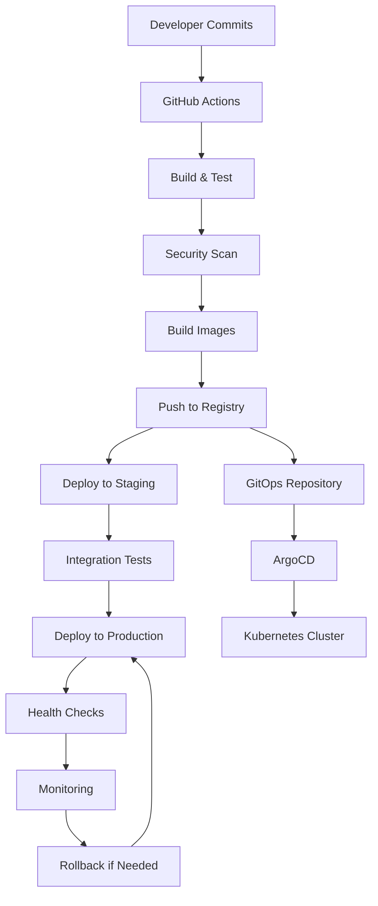

# CI/CD Pipeline for Microservices

## 🎯 Overview

This document outlines the comprehensive CI/CD pipeline for the LINE Bot microservices architecture. The pipeline implements **GitOps principles** with **automated testing**, **security scanning**, **blue-green deployments**, and **rollback capabilities**.

## 🏗️ Pipeline Architecture

### GitOps Workflow



## 🔧 GitHub Actions Workflows

### Main CI/CD Workflow

```yaml
# .github/workflows/microservices-ci-cd.yml
name: Microservices CI/CD Pipeline

on:
  push:
    branches: [main, develop]
    paths:
      - 'microservices/**'
      - '.github/workflows/**'
  pull_request:
    branches: [main]
    paths:
      - 'microservices/**'

env:
  REGISTRY: ghcr.io
  REGISTRY_USER: ${{ github.actor }}
  REGISTRY_PASSWORD: ${{ secrets.GITHUB_TOKEN }}
  NODE_VERSION: '18'
  DOCKER_BUILDKIT: 1

jobs:
  # Detect changed services
  detect-changes:
    name: Detect Changed Services
    runs-on: ubuntu-latest
    outputs:
      services: ${{ steps.changes.outputs.services }}
      has-changes: ${{ steps.changes.outputs.has-changes }}
    steps:
      - name: Checkout code
        uses: actions/checkout@v4
        with:
          fetch-depth: 0

      - name: Detect changed services
        id: changes
        run: |
          # Get list of changed files
          CHANGED_FILES=$(git diff --name-only HEAD~1 HEAD)
          
          # Extract unique service names
          SERVICES=$(echo "$CHANGED_FILES" | grep "^microservices/services/" | cut -d'/' -f3 | sort -u | jq -R -s -c 'split("\n")[:-1]')
          
          # Check for infrastructure changes
          INFRA_CHANGES=$(echo "$CHANGED_FILES" | grep -E "^microservices/(infrastructure|docker-compose)" | wc -l)
          
          if [ "$INFRA_CHANGES" -gt 0 ]; then
            # If infrastructure changed, rebuild all services
            SERVICES='["line-bot-gateway","ai-conversation","customer-management","product-catalog","healthcare-research","monitoring-admin","cache-storage","auth-security"]'
          fi
          
          echo "services=$SERVICES" >> $GITHUB_OUTPUT
          echo "has-changes=$([ "$SERVICES" != "[]" ] && echo "true" || echo "false")" >> $GITHUB_OUTPUT
          echo "Detected services: $SERVICES"

  # Lint and code quality
  code-quality:
    name: Code Quality & Linting
    runs-on: ubuntu-latest
    needs: detect-changes
    if: needs.detect-changes.outputs.has-changes == 'true'
    
    steps:
      - name: Checkout code
        uses: actions/checkout@v4

      - name: Setup Node.js
        uses: actions/setup-node@v4
        with:
          node-version: ${{ env.NODE_VERSION }}
          cache: 'npm'
          cache-dependency-path: 'microservices/services/*/package-lock.json'

      - name: Install dependencies
        run: |
          for service in $(echo '${{ needs.detect-changes.outputs.services }}' | jq -r '.[]'); do
            if [ -f "microservices/services/$service/package.json" ]; then
              echo "Installing dependencies for $service..."
              cd "microservices/services/$service"
              npm ci
              cd ../../..
            fi
          done

      - name: Run ESLint
        run: |
          for service in $(echo '${{ needs.detect-changes.outputs.services }}' | jq -r '.[]'); do
            if [ -f "microservices/services/$service/package.json" ]; then
              echo "Running ESLint for $service..."
              cd "microservices/services/$service"
              npm run lint
              cd ../../..
            fi
          done

      - name: Run Prettier check
        run: |
          for service in $(echo '${{ needs.detect-changes.outputs.services }}' | jq -r '.[]'); do
            if [ -f "microservices/services/$service/package.json" ]; then
              echo "Running Prettier check for $service..."
              cd "microservices/services/$service"
              npx prettier --check "**/*.{js,ts,json,md}"
              cd ../../..
            fi
          done

  # Unit tests
  unit-tests:
    name: Unit Tests
    runs-on: ubuntu-latest
    needs: [detect-changes, code-quality]
    if: needs.detect-changes.outputs.has-changes == 'true'
    
    strategy:
      matrix:
        service: ${{ fromJson(needs.detect-changes.outputs.services) }}
    
    steps:
      - name: Checkout code
        uses: actions/checkout@v4

      - name: Setup Node.js
        uses: actions/setup-node@v4
        with:
          node-version: ${{ env.NODE_VERSION }}
          cache: 'npm'
          cache-dependency-path: 'microservices/services/${{ matrix.service }}/package-lock.json'

      - name: Install dependencies
        run: |
          cd microservices/services/${{ matrix.service }}
          npm ci

      - name: Run unit tests
        run: |
          cd microservices/services/${{ matrix.service }}
          npm run test:coverage

      - name: Upload coverage reports
        uses: codecov/codecov-action@v3
        with:
          files: ./microservices/services/${{ matrix.service }}/coverage/lcov.info
          flags: ${{ matrix.service }}
          name: ${{ matrix.service }}-coverage

  # Security scanning
  security-scan:
    name: Security Scan
    runs-on: ubuntu-latest
    needs: [detect-changes, code-quality]
    if: needs.detect-changes.outputs.has-changes == 'true'
    
    steps:
      - name: Checkout code
        uses: actions/checkout@v4

      - name: Run npm audit
        run: |
          for service in $(echo '${{ needs.detect-changes.outputs.services }}' | jq -r '.[]'); do
            if [ -f "microservices/services/$service/package.json" ]; then
              echo "Running npm audit for $service..."
              cd "microservices/services/$service"
              npm audit --audit-level=high
              cd ../../..
            fi
          done

      - name: Run Snyk security scan
        uses: snyk/actions/node@master
        env:
          SNYK_TOKEN: ${{ secrets.SNYK_TOKEN }}
        with:
          args: --all-projects --severity-threshold=high

      - name: Run Trivy vulnerability scanner
        uses: aquasecurity/trivy-action@master
        with:
          scan-type: 'fs'
          scan-ref: 'microservices/'
          format: 'sarif'
          output: 'trivy-results.sarif'

      - name: Upload Trivy scan results
        uses: github/codeql-action/upload-sarif@v2
        if: always()
        with:
          sarif_file: 'trivy-results.sarif'

  # Build Docker images
  build-images:
    name: Build Docker Images
    runs-on: ubuntu-latest
    needs: [detect-changes, unit-tests, security-scan]
    if: needs.detect-changes.outputs.has-changes == 'true'
    
    strategy:
      matrix:
        service: ${{ fromJson(needs.detect-changes.outputs.services) }}
    
    steps:
      - name: Checkout code
        uses: actions/checkout@v4

      - name: Set up Docker Buildx
        uses: docker/setup-buildx-action@v3

      - name: Log in to Container Registry
        uses: docker/login-action@v3
        with:
          registry: ${{ env.REGISTRY }}
          username: ${{ env.REGISTRY_USER }}
          password: ${{ env.REGISTRY_PASSWORD }}

      - name: Extract metadata
        id: meta
        uses: docker/metadata-action@v5
        with:
          images: ${{ env.REGISTRY }}/${{ github.repository }}/${{ matrix.service }}
          tags: |
            type=ref,event=branch
            type=ref,event=pr
            type=sha,prefix={{branch}}-
            type=raw,value=latest,enable={{is_default_branch}}

      - name: Build and push Docker image
        uses: docker/build-push-action@v5
        with:
          context: microservices/services/${{ matrix.service }}
          platforms: linux/amd64,linux/arm64
          push: true
          tags: ${{ steps.meta.outputs.tags }}
          labels: ${{ steps.meta.outputs.labels }}
          cache-from: type=gha
          cache-to: type=gha,mode=max
          build-args: |
            SERVICE_NAME=${{ matrix.service }}
            BUILD_DATE=${{ github.event.head_commit.timestamp }}
            VCS_REF=${{ github.sha }}

  # Deploy to staging
  deploy-staging:
    name: Deploy to Staging
    runs-on: ubuntu-latest
    needs: [detect-changes, build-images]
    if: needs.detect-changes.outputs.has-changes == 'true' && github.ref == 'refs/heads/develop'
    environment: staging
    
    steps:
      - name: Checkout GitOps repository
        uses: actions/checkout@v4
        with:
          repository: ${{ github.repository }}-gitops
          token: ${{ secrets.GITOPS_TOKEN }}
          path: gitops

      - name: Update staging manifests
        run: |
          cd gitops
          
          for service in $(echo '${{ needs.detect-changes.outputs.services }}' | jq -r '.[]'); do
            IMAGE_TAG="${GITHUB_SHA:0:7}"
            
            # Update image tag in Kubernetes manifests
            sed -i "s|image: .*/$service:.*|image: ${{ env.REGISTRY }}/${{ github.repository }}/$service:develop-$IMAGE_TAG|g" \
              environments/staging/services/$service.yaml
          done
          
          # Commit and push changes
          git config user.name "GitHub Actions"
          git config user.email "actions@github.com"
          git add .
          git commit -m "Update staging images from ${{ github.sha }}"
          git push

      - name: Wait for ArgoCD sync
        run: |
          echo "Waiting for ArgoCD to sync staging environment..."
          sleep 60

  # Integration tests
  integration-tests:
    name: Integration Tests
    runs-on: ubuntu-latest
    needs: [detect-changes, deploy-staging]
    if: needs.detect-changes.outputs.has-changes == 'true' && github.ref == 'refs/heads/develop'
    
    steps:
      - name: Checkout code
        uses: actions/checkout@v4

      - name: Setup Node.js
        uses: actions/setup-node@v4
        with:
          node-version: ${{ env.NODE_VERSION }}

      - name: Install test dependencies
        run: |
          cd tests/integration
          npm ci

      - name: Run integration tests
        env:
          TEST_BASE_URL: ${{ secrets.STAGING_BASE_URL }}
          TEST_API_KEY: ${{ secrets.STAGING_API_KEY }}
        run: |
          cd tests/integration
          npm run test:integration

      - name: Run E2E tests
        env:
          TEST_BASE_URL: ${{ secrets.STAGING_BASE_URL }}
        run: |
          cd tests/e2e
          npm ci
          npm run test:e2e

  # Deploy to production
  deploy-production:
    name: Deploy to Production
    runs-on: ubuntu-latest
    needs: [detect-changes, build-images, integration-tests]
    if: needs.detect-changes.outputs.has-changes == 'true' && github.ref == 'refs/heads/main'
    environment: production
    
    steps:
      - name: Checkout GitOps repository
        uses: actions/checkout@v4
        with:
          repository: ${{ github.repository }}-gitops
          token: ${{ secrets.GITOPS_TOKEN }}
          path: gitops

      - name: Update production manifests
        run: |
          cd gitops
          
          for service in $(echo '${{ needs.detect-changes.outputs.services }}' | jq -r '.[]'); do
            IMAGE_TAG="${GITHUB_SHA:0:7}"
            
            # Update image tag in Kubernetes manifests
            sed -i "s|image: .*/$service:.*|image: ${{ env.REGISTRY }}/${{ github.repository }}/$service:main-$IMAGE_TAG|g" \
              environments/production/services/$service.yaml
          done
          
          # Commit and push changes
          git config user.name "GitHub Actions"
          git config user.email "actions@github.com"
          git add .
          git commit -m "Deploy to production from ${{ github.sha }}"
          git push

      - name: Create deployment record
        run: |
          # Record deployment for tracking
          cat > deployment-record.json << EOF
          {
            "deployment_id": "${{ github.run_id }}",
            "commit_sha": "${{ github.sha }}",
            "services": ${{ needs.detect-changes.outputs.services }},
            "environment": "production",
            "deployed_at": "$(date -u +%Y-%m-%dT%H:%M:%SZ)",
            "deployed_by": "${{ github.actor }}"
          }
          EOF
          
          # Send to monitoring service
          curl -X POST "${{ secrets.MONITORING_WEBHOOK_URL }}/deployments" \
            -H "Content-Type: application/json" \
            -H "Authorization: Bearer ${{ secrets.MONITORING_API_KEY }}" \
            -d @deployment-record.json

  # Post-deployment verification
  post-deployment-checks:
    name: Post-Deployment Verification
    runs-on: ubuntu-latest
    needs: [detect-changes, deploy-production]
    if: needs.detect-changes.outputs.has-changes == 'true' && github.ref == 'refs/heads/main'
    
    steps:
      - name: Wait for deployment rollout
        run: |
          echo "Waiting for deployment to complete..."
          sleep 120

      - name: Health check verification
        run: |
          for service in $(echo '${{ needs.detect-changes.outputs.services }}' | jq -r '.[]'); do
            echo "Checking health of $service..."
            
            # Health check with retry
            for i in {1..10}; do
              if curl -f "${{ secrets.PRODUCTION_BASE_URL }}/api/$service/health"; then
                echo "$service is healthy"
                break
              else
                echo "Attempt $i failed, retrying in 30s..."
                sleep 30
              fi
              
              if [ $i -eq 10 ]; then
                echo "Health check failed for $service"
                exit 1
              fi
            done
          done

      - name: Performance baseline check
        run: |
          # Run performance tests to ensure no regression
          cd tests/performance
          npm ci
          npm run test:baseline
          
      - name: Alert on success
        if: success()
        run: |
          curl -X POST "${{ secrets.SLACK_WEBHOOK_URL }}" \
            -H "Content-Type: application/json" \
            -d '{
              "text": "✅ Deployment successful",
              "attachments": [{
                "color": "good",
                "fields": [
                  {"title": "Commit", "value": "${{ github.sha }}", "short": true},
                  {"title": "Services", "value": "${{ needs.detect-changes.outputs.services }}", "short": true},
                  {"title": "Environment", "value": "production", "short": true}
                ]
              }]
            }'

      - name: Alert on failure
        if: failure()
        run: |
          curl -X POST "${{ secrets.SLACK_WEBHOOK_URL }}" \
            -H "Content-Type: application/json" \
            -d '{
              "text": "❌ Deployment failed",
              "attachments": [{
                "color": "danger",
                "fields": [
                  {"title": "Commit", "value": "${{ github.sha }}", "short": true},
                  {"title": "Services", "value": "${{ needs.detect-changes.outputs.services }}", "short": true},
                  {"title": "Environment", "value": "production", "short": true},
                  {"title": "Workflow", "value": "${{ github.server_url }}/${{ github.repository }}/actions/runs/${{ github.run_id }}", "short": false}
                ]
              }]
            }'
```

### Rollback Workflow

```yaml
# .github/workflows/rollback.yml
name: Production Rollback

on:
  workflow_dispatch:
    inputs:
      services:
        description: 'Services to rollback (JSON array)'
        required: true
        default: '["line-bot-gateway"]'
      target_commit:
        description: 'Target commit SHA to rollback to'
        required: true
      reason:
        description: 'Reason for rollback'
        required: true

env:
  REGISTRY: ghcr.io

jobs:
  rollback:
    name: Rollback Services
    runs-on: ubuntu-latest
    environment: production
    
    steps:
      - name: Validate inputs
        run: |
          echo "Services to rollback: ${{ github.event.inputs.services }}"
          echo "Target commit: ${{ github.event.inputs.target_commit }}"
          echo "Reason: ${{ github.event.inputs.reason }}"

      - name: Checkout GitOps repository
        uses: actions/checkout@v4
        with:
          repository: ${{ github.repository }}-gitops
          token: ${{ secrets.GITOPS_TOKEN }}
          path: gitops

      - name: Verify target commit exists
        run: |
          # Verify the target commit exists and has built images
          for service in $(echo '${{ github.event.inputs.services }}' | jq -r '.[]'); do
            IMAGE_TAG="${{ github.event.inputs.target_commit }}"
            IMAGE_NAME="${{ env.REGISTRY }}/${{ github.repository }}/$service:main-${IMAGE_TAG:0:7}"
            
            echo "Checking if image exists: $IMAGE_NAME"
            if ! docker manifest inspect "$IMAGE_NAME" > /dev/null 2>&1; then
              echo "Error: Image $IMAGE_NAME does not exist"
              exit 1
            fi
          done

      - name: Execute rollback
        run: |
          cd gitops
          
          for service in $(echo '${{ github.event.inputs.services }}' | jq -r '.[]'); do
            IMAGE_TAG="${{ github.event.inputs.target_commit }}"
            
            echo "Rolling back $service to commit ${IMAGE_TAG:0:7}"
            
            # Update image tag in Kubernetes manifests
            sed -i "s|image: .*/$service:.*|image: ${{ env.REGISTRY }}/${{ github.repository }}/$service:main-${IMAGE_TAG:0:7}|g" \
              environments/production/services/$service.yaml
          done
          
          # Commit and push changes
          git config user.name "GitHub Actions (Rollback)"
          git config user.email "actions@github.com"
          git add .
          git commit -m "ROLLBACK: Revert services to ${{ github.event.inputs.target_commit }}

          Services: ${{ github.event.inputs.services }}
          Reason: ${{ github.event.inputs.reason }}
          Triggered by: ${{ github.actor }}"
          git push

      - name: Create rollback record
        run: |
          cat > rollback-record.json << EOF
          {
            "rollback_id": "${{ github.run_id }}",
            "from_commit": "current",
            "to_commit": "${{ github.event.inputs.target_commit }}",
            "services": ${{ github.event.inputs.services }},
            "reason": "${{ github.event.inputs.reason }}",
            "environment": "production",
            "rolled_back_at": "$(date -u +%Y-%m-%dT%H:%M:%SZ)",
            "rolled_back_by": "${{ github.actor }}"
          }
          EOF
          
          # Send to monitoring service
          curl -X POST "${{ secrets.MONITORING_WEBHOOK_URL }}/rollbacks" \
            -H "Content-Type: application/json" \
            -H "Authorization: Bearer ${{ secrets.MONITORING_API_KEY }}" \
            -d @rollback-record.json

      - name: Verify rollback
        run: |
          echo "Waiting for rollback to complete..."
          sleep 120
          
          for service in $(echo '${{ github.event.inputs.services }}' | jq -r '.[]'); do
            echo "Verifying rollback of $service..."
            
            # Health check with retry
            for i in {1..10}; do
              if curl -f "${{ secrets.PRODUCTION_BASE_URL }}/api/$service/health"; then
                echo "$service rollback successful"
                break
              else
                echo "Attempt $i failed, retrying in 30s..."
                sleep 30
              fi
              
              if [ $i -eq 10 ]; then
                echo "Rollback verification failed for $service"
                exit 1
              fi
            done
          done

      - name: Alert on rollback completion
        run: |
          curl -X POST "${{ secrets.SLACK_WEBHOOK_URL }}" \
            -H "Content-Type: application/json" \
            -d '{
              "text": "🔄 Rollback completed",
              "attachments": [{
                "color": "warning",
                "fields": [
                  {"title": "Services", "value": "${{ github.event.inputs.services }}", "short": true},
                  {"title": "Target Commit", "value": "${{ github.event.inputs.target_commit }}", "short": true},
                  {"title": "Reason", "value": "${{ github.event.inputs.reason }}", "short": false},
                  {"title": "Rolled back by", "value": "${{ github.actor }}", "short": true}
                ]
              }]
            }'
```

## 🚀 Kubernetes Deployment Manifests

### ArgoCD Application

```yaml
# gitops/applications/line-bot-microservices.yaml
apiVersion: argoproj.io/v1alpha1
kind: Application
metadata:
  name: line-bot-microservices
  namespace: argocd
spec:
  project: default
  source:
    repoURL: https://github.com/your-org/line-bot-gitops
    targetRevision: HEAD
    path: environments/production
  destination:
    server: https://kubernetes.default.svc
    namespace: line-bot
  syncPolicy:
    automated:
      prune: true
      selfHeal: true
      allowEmpty: false
    syncOptions:
      - CreateNamespace=true
      - PrunePropagationPolicy=foreground
      - PruneLast=true
    retry:
      limit: 5
      backoff:
        duration: 5s
        factor: 2
        maxDuration: 3m
  revisionHistoryLimit: 10
```

### Service Deployment Template

```yaml
# gitops/environments/production/services/line-bot-gateway.yaml
apiVersion: apps/v1
kind: Deployment
metadata:
  name: line-bot-gateway
  namespace: line-bot
  labels:
    app: line-bot-gateway
    version: v1
spec:
  replicas: 3
  strategy:
    type: RollingUpdate
    rollingUpdate:
      maxUnavailable: 1
      maxSurge: 1
  selector:
    matchLabels:
      app: line-bot-gateway
  template:
    metadata:
      labels:
        app: line-bot-gateway
        version: v1
      annotations:
        prometheus.io/scrape: "true"
        prometheus.io/port: "3000"
        prometheus.io/path: "/metrics"
    spec:
      serviceAccountName: line-bot-gateway
      containers:
      - name: line-bot-gateway
        image: ghcr.io/your-org/line-bot/line-bot-gateway:main-abc1234
        ports:
        - containerPort: 3000
          name: http
        env:
        - name: NODE_ENV
          value: "production"
        - name: SERVICE_NAME
          value: "line-bot-gateway"
        - name: SERVICE_PORT
          value: "3000"
        - name: DATABASE_URL
          valueFrom:
            secretKeyRef:
              name: line-bot-secrets
              key: conversations-db-url
        - name: REDIS_URL
          valueFrom:
            secretKeyRef:
              name: line-bot-secrets
              key: redis-url
        - name: CHANNEL_ACCESS_TOKEN
          valueFrom:
            secretKeyRef:
              name: line-bot-secrets
              key: channel-access-token
        - name: CHANNEL_SECRET
          valueFrom:
            secretKeyRef:
              name: line-bot-secrets
              key: channel-secret
        resources:
          requests:
            memory: "256Mi"
            cpu: "200m"
          limits:
            memory: "512Mi"
            cpu: "500m"
        livenessProbe:
          httpGet:
            path: /health/liveness
            port: 3000
          initialDelaySeconds: 30
          periodSeconds: 10
          timeoutSeconds: 5
          failureThreshold: 3
        readinessProbe:
          httpGet:
            path: /health/readiness
            port: 3000
          initialDelaySeconds: 5
          periodSeconds: 5
          timeoutSeconds: 3
          failureThreshold: 3
        securityContext:
          allowPrivilegeEscalation: false
          runAsNonRoot: true
          runAsUser: 1001
          readOnlyRootFilesystem: true
          capabilities:
            drop:
            - ALL
        volumeMounts:
        - name: tmp
          mountPath: /tmp
        - name: logs
          mountPath: /app/logs
      volumes:
      - name: tmp
        emptyDir: {}
      - name: logs
        emptyDir: {}
      affinity:
        podAntiAffinity:
          preferredDuringSchedulingIgnoredDuringExecution:
          - weight: 100
            podAffinityTerm:
              labelSelector:
                matchExpressions:
                - key: app
                  operator: In
                  values:
                  - line-bot-gateway
              topologyKey: kubernetes.io/hostname

---
apiVersion: v1
kind: Service
metadata:
  name: line-bot-gateway
  namespace: line-bot
  labels:
    app: line-bot-gateway
spec:
  selector:
    app: line-bot-gateway
  ports:
  - name: http
    port: 80
    targetPort: 3000
    protocol: TCP
  type: ClusterIP

---
apiVersion: networking.k8s.io/v1
kind: Ingress
metadata:
  name: line-bot-gateway
  namespace: line-bot
  annotations:
    kubernetes.io/ingress.class: "nginx"
    nginx.ingress.kubernetes.io/ssl-redirect: "true"
    nginx.ingress.kubernetes.io/force-ssl-redirect: "true"
    cert-manager.io/cluster-issuer: "letsencrypt-prod"
    nginx.ingress.kubernetes.io/rate-limit: "100"
spec:
  tls:
  - hosts:
    - api.linebot.example.com
    secretName: line-bot-tls
  rules:
  - host: api.linebot.example.com
    http:
      paths:
      - path: /webhook
        pathType: Prefix
        backend:
          service:
            name: line-bot-gateway
            port:
              number: 80
```

## 🧪 Testing Pipeline

### Integration Test Configuration

```javascript
// tests/integration/jest.config.js
module.exports = {
  testEnvironment: 'node',
  testMatch: ['**/__tests__/**/*.integration.js'],
  testTimeout: 30000,
  setupFilesAfterEnv: ['<rootDir>/setup.js'],
  collectCoverageFrom: [
    'src/**/*.js',
    '!src/**/*.test.js',
    '!src/coverage/**'
  ],
  coverageReporters: ['text', 'lcov', 'html'],
  verbose: true
};
```

```javascript
// tests/integration/setup.js
const axios = require('axios');

// Global test configuration
global.testConfig = {
  baseURL: process.env.TEST_BASE_URL || 'http://localhost',
  apiKey: process.env.TEST_API_KEY || 'test-api-key',
  timeout: 30000
};

// Create axios instance for tests
global.api = axios.create({
  baseURL: global.testConfig.baseURL,
  timeout: global.testConfig.timeout,
  headers: {
    'Content-Type': 'application/json',
    'X-API-Key': global.testConfig.apiKey
  }
});

// Setup and teardown
beforeAll(async () => {
  console.log('Setting up integration tests...');
  
  // Wait for services to be ready
  await waitForServices();
});

afterAll(async () => {
  console.log('Cleaning up after integration tests...');
});

async function waitForServices() {
  const services = [
    'line-bot-gateway',
    'ai-conversation',
    'customer-management',
    'product-catalog'
  ];
  
  for (const service of services) {
    console.log(`Waiting for ${service} to be ready...`);
    
    let retries = 30;
    while (retries > 0) {
      try {
        await global.api.get(`/api/${service}/health`);
        console.log(`✅ ${service} is ready`);
        break;
      } catch (error) {
        retries--;
        if (retries === 0) {
          throw new Error(`Service ${service} failed to become ready`);
        }
        await new Promise(resolve => setTimeout(resolve, 2000));
      }
    }
  }
}
```

### Sample Integration Test

```javascript
// tests/integration/__tests__/api-flow.integration.js
describe('LINE Bot API Flow Integration', () => {
  let testCustomerId;
  let conversationId;
  
  beforeAll(async () => {
    // Create test customer
    const customerResponse = await global.api.post('/api/customers', {
      lineUserId: 'test-user-123',
      displayName: 'Test User',
      profile: {
        language: 'en',
        preferences: ['electronics']
      }
    });
    
    testCustomerId = customerResponse.data.data.lineUserId;
  });
  
  afterAll(async () => {
    // Cleanup test data
    if (testCustomerId) {
      await global.api.delete(`/api/customers/${testCustomerId}`);
    }
  });
  
  test('Complete conversation flow', async () => {
    // 1. Simulate LINE webhook
    const webhookResponse = await global.api.post('/webhook', {
      events: [{
        type: 'message',
        message: {
          type: 'text',
          text: 'Hello, I want to buy a product'
        },
        source: {
          userId: testCustomerId,
          type: 'user'
        },
        timestamp: Date.now()
      }]
    });
    
    expect(webhookResponse.status).toBe(200);
    
    // 2. Check AI response generation
    const aiResponse = await global.api.post('/api/ai/generate', {
      userId: testCustomerId,
      message: 'I want to buy a product',
      context: {
        language: 'en',
        userProfile: {
          preferences: ['electronics']
        }
      }
    });
    
    expect(aiResponse.status).toBe(200);
    expect(aiResponse.data.success).toBe(true);
    expect(aiResponse.data.data.response).toBeTruthy();
    
    // 3. Check customer activity tracking
    const customerResponse = await global.api.get(`/api/customers/${testCustomerId}`);
    expect(customerResponse.status).toBe(200);
    expect(customerResponse.data.data.analytics.totalMessages).toBeGreaterThan(0);
    
    // 4. Search for products
    const productSearch = await global.api.get('/api/products', {
      params: {
        search: 'electronics',
        language: 'en',
        limit: 5
      }
    });
    
    expect(productSearch.status).toBe(200);
    expect(productSearch.data.data.items).toBeTruthy();
    
    // 5. Get conversation history
    const conversationHistory = await global.api.get(`/api/ai/conversation/${testCustomerId}`);
    expect(conversationHistory.status).toBe(200);
    expect(conversationHistory.data.data.messages).toBeTruthy();
  });
  
  test('Error handling and fallbacks', async () => {
    // Test AI service fallback
    const response = await global.api.post('/api/ai/generate', {
      userId: 'invalid-user',
      message: 'Test message',
      context: {}
    });
    
    // Should still return a response (fallback)
    expect(response.status).toBe(200);
    expect(response.data.data.response).toBeTruthy();
  });
  
  test('Rate limiting', async () => {
    const requests = [];
    
    // Send 20 rapid requests
    for (let i = 0; i < 20; i++) {
      requests.push(
        global.api.get('/api/products').catch(error => error.response)
      );
    }
    
    const responses = await Promise.all(requests);
    const rateLimited = responses.filter(r => r.status === 429);
    
    // Expect some requests to be rate limited
    expect(rateLimited.length).toBeGreaterThan(0);
  });
});
```

### Performance Test Configuration

```javascript
// tests/performance/load-test.js
const autocannon = require('autocannon');

async function runLoadTest() {
  const results = await autocannon({
    url: process.env.TEST_BASE_URL || 'http://localhost',
    connections: 10,
    pipelining: 1,
    duration: 30,
    requests: [
      {
        method: 'GET',
        path: '/health'
      },
      {
        method: 'GET',
        path: '/api/products',
        headers: {
          'X-API-Key': process.env.TEST_API_KEY
        }
      },
      {
        method: 'POST',
        path: '/api/ai/generate',
        headers: {
          'Content-Type': 'application/json',
          'X-API-Key': process.env.TEST_API_KEY
        },
        body: JSON.stringify({
          userId: 'test-user-123',
          message: 'Hello',
          context: { language: 'en' }
        })
      }
    ]
  });
  
  console.log('Load Test Results:');
  console.log(`Requests/sec: ${results.requests.average}`);
  console.log(`Latency (avg): ${results.latency.average}ms`);
  console.log(`Latency (p95): ${results.latency.p95}ms`);
  console.log(`Latency (p99): ${results.latency.p99}ms`);
  console.log(`Errors: ${results.errors}`);
  
  // Performance assertions
  if (results.latency.p95 > 1000) {
    throw new Error(`P95 latency too high: ${results.latency.p95}ms`);
  }
  
  if (results.errors > results.requests.total * 0.01) {
    throw new Error(`Error rate too high: ${(results.errors / results.requests.total * 100).toFixed(2)}%`);
  }
  
  return results;
}

if (require.main === module) {
  runLoadTest().catch(console.error);
}

module.exports = { runLoadTest };
```

## 📊 Deployment Monitoring

### Deployment Health Check Script

```bash
#!/bin/bash
# scripts/deployment-health-check.sh

set -e

SERVICE_NAME=$1
NAMESPACE=${2:-line-bot}
TIMEOUT=${3:-300}

if [ -z "$SERVICE_NAME" ]; then
    echo "Usage: $0 <service-name> [namespace] [timeout]"
    exit 1
fi

echo "🚀 Monitoring deployment of $SERVICE_NAME in namespace $NAMESPACE"

# Wait for deployment to be ready
echo "Waiting for deployment to be ready..."
kubectl rollout status deployment/$SERVICE_NAME -n $NAMESPACE --timeout=${TIMEOUT}s

# Check pod health
echo "Checking pod health..."
READY_PODS=$(kubectl get pods -n $NAMESPACE -l app=$SERVICE_NAME -o jsonpath='{.items[?(@.status.phase=="Running")].metadata.name}' | wc -w)
TOTAL_PODS=$(kubectl get pods -n $NAMESPACE -l app=$SERVICE_NAME -o jsonpath='{.items[*].metadata.name}' | wc -w)

echo "Ready pods: $READY_PODS/$TOTAL_PODS"

if [ "$READY_PODS" -eq "$TOTAL_PODS" ] && [ "$READY_PODS" -gt 0 ]; then
    echo "✅ All pods are ready"
else
    echo "❌ Not all pods are ready"
    kubectl get pods -n $NAMESPACE -l app=$SERVICE_NAME
    exit 1
fi

# Health check endpoint
SERVICE_URL=$(kubectl get service $SERVICE_NAME -n $NAMESPACE -o jsonpath='{.status.loadBalancer.ingress[0].ip}')
if [ -z "$SERVICE_URL" ]; then
    SERVICE_URL="localhost"
    kubectl port-forward service/$SERVICE_NAME 8080:80 -n $NAMESPACE &
    PORT_FORWARD_PID=$!
    SERVICE_URL="localhost:8080"
    sleep 5
fi

echo "Testing health endpoint at $SERVICE_URL..."
for i in {1..10}; do
    if curl -f "http://$SERVICE_URL/health" > /dev/null 2>&1; then
        echo "✅ Health check passed"
        break
    else
        echo "Attempt $i failed, retrying in 10s..."
        sleep 10
    fi
    
    if [ $i -eq 10 ]; then
        echo "❌ Health check failed after 10 attempts"
        exit 1
    fi
done

# Cleanup port forward if used
if [ ! -z "$PORT_FORWARD_PID" ]; then
    kill $PORT_FORWARD_PID
fi

echo "🎉 Deployment verification completed successfully!"
```

This comprehensive CI/CD pipeline provides automated testing, security scanning, staged deployments, and monitoring with robust rollback capabilities for the microservices architecture.