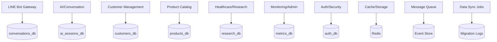

# Database Migration Strategy for Microservices

## 🎯 Overview

This document outlines the comprehensive database migration strategy for transitioning from a monolithic MongoDB database to a database-per-service architecture. The migration follows a **gradual, zero-downtime approach** using the **Dual Write Pattern** and **Strangler Fig Pattern**.

## 📊 Current Database Analysis

### Monolith Database Structure
```
mongodb://localhost:27017/linechatbot
├── conversations (in-memory fallback)
├── customers (in-memory fallback)  
├── products (in-memory fallback)
├── cache_entries (Redis alternative)
├── logs (file-based)
└── metrics (in-memory)
```

### Current Data Dependencies
- **Shared User Context**: Customer data referenced across conversations and products
- **Cross-Domain Queries**: Analytics spanning customers, conversations, and products
- **Session Management**: Conversation state tied to customer profiles
- **Cache Dependencies**: Shared caching layer for AI responses and product data

## 🏗️ Target Database Architecture

### Database-per-Service Design



### Service Database Breakdown

#### 1. Conversations Database (`conversations_db`)
**Service**: LINE Bot Gateway Service  
**Port**: 27017  
**Purpose**: Webhook events, conversation routing, message history

```javascript
// Collections
conversations: {
  _id: ObjectId,
  lineUserId: String,
  displayName: String,
  status: String, // 'active', 'ended', 'paused'
  language: String,
  messages: [{
    messageId: String,
    role: String, // 'user', 'assistant', 'system'
    content: String,
    timestamp: Date,
    metadata: {
      intent: String,
      sentiment: String,
      confidence: Number
    }
  }],
  sessionStart: Date,
  lastActivity: Date,
  metadata: Map,
  createdAt: Date,
  updatedAt: Date
}

webhook_events: {
  _id: ObjectId,
  eventId: String,
  eventType: String,
  lineUserId: String,
  timestamp: Date,
  payload: Object,
  status: String, // 'received', 'processed', 'failed'
  processingTime: Number,
  correlationId: String,
  createdAt: Date
}
```

#### 2. AI Sessions Database (`ai_sessions_db`)
**Service**: AI/Conversation Service  
**Port**: 27018  
**Purpose**: AI provider management, conversation context, response caching

```javascript
// Collections
ai_sessions: {
  _id: ObjectId,
  sessionId: String,
  lineUserId: String,
  provider: String, // 'deepSeek', 'openRouter'
  context: [{
    role: String,
    content: String,
    timestamp: Date
  }],
  language: String,
  userProfile: {
    preferences: [String],
    interests: [String],
    purchaseHistory: [String]
  },
  metadata: {
    totalTokens: Number,
    avgResponseTime: Number,
    successRate: Number
  },
  status: String, // 'active', 'ended'
  createdAt: Date,
  updatedAt: Date
}

ai_responses: {
  _id: ObjectId,
  responseId: String,
  sessionId: String,
  lineUserId: String,
  provider: String,
  prompt: String,
  response: String,
  tokensUsed: Number,
  processingTime: Number,
  confidence: Number,
  intent: String,
  entities: [String],
  cached: Boolean,
  timestamp: Date,
  createdAt: Date
}

provider_stats: {
  _id: ObjectId,
  provider: String,
  date: Date,
  calls: Number,
  success: Number,
  failures: Number,
  avgResponseTime: Number,
  totalTokens: Number,
  errorTypes: [{
    type: String,
    count: Number
  }],
  createdAt: Date
}
```

#### 3. Customers Database (`customers_db`)
**Service**: Customer Management Service  
**Port**: 27019  
**Purpose**: Customer profiles, preferences, analytics, purchase history

```javascript
// Collections
customers: {
  _id: ObjectId,
  lineUserId: String, // Primary key
  displayName: String,
  profile: {
    language: String,
    timezone: String,
    country: String,
    preferences: [String],
    interests: [String]
  },
  analytics: {
    totalMessages: Number,
    totalSessions: Number,
    avgSessionLength: Number,
    lastActivity: Date,
    joinDate: Date,
    engagementScore: Number
  },
  segmentation: {
    tier: String, // 'basic', 'premium', 'vip'
    engagement: String, // 'low', 'medium', 'high'
    purchaseIntent: String, // 'low', 'medium', 'high'
    lifetimeValue: Number
  },
  purchaseHistory: [{
    purchaseId: String,
    productId: String,
    productName: String,
    amount: Number,
    currency: String,
    purchaseDate: Date,
    status: String,
    metadata: Object
  }],
  createdAt: Date,
  updatedAt: Date
}

customer_events: {
  _id: ObjectId,
  eventId: String,
  lineUserId: String,
  eventType: String, // 'message_sent', 'product_viewed', 'purchase_made'
  eventData: Object,
  timestamp: Date,
  source: String, // service that generated the event
  correlationId: String,
  createdAt: Date
}
```

#### 4. Products Database (`products_db`)
**Service**: Product Catalog Service  
**Port**: 27020  
**Purpose**: Product catalog, categories, inventory, multilingual content

```javascript
// Collections
products: {
  _id: ObjectId,
  productId: String, // Primary key
  name: String,
  description: String,
  price: Number,
  currency: String,
  category: String,
  subcategory: String,
  images: [String],
  specifications: Object,
  availability: {
    inStock: Boolean,
    quantity: Number,
    reorderLevel: Number
  },
  multilingual: {
    en: {
      name: String,
      description: String,
      specifications: Object
    },
    th: {
      name: String,
      description: String,
      specifications: Object
    }
  },
  seo: {
    tags: [String],
    searchTerms: [String]
  },
  analytics: {
    views: Number,
    purchases: Number,
    conversionRate: Number,
    rating: Number,
    reviewCount: Number
  },
  status: String, // 'active', 'discontinued', 'out_of_stock'
  createdAt: Date,
  updatedAt: Date
}

categories: {
  _id: ObjectId,
  categoryId: String,
  name: String,
  description: String,
  parentCategory: String,
  subcategories: [String],
  productCount: Number,
  multilingual: {
    en: { name: String, description: String },
    th: { name: String, description: String }
  },
  displayOrder: Number,
  status: String,
  createdAt: Date,
  updatedAt: Date
}
```

#### 5. Research Database (`research_db`)
**Service**: Healthcare/Research Service  
**Port**: 27021  
**Purpose**: Research cache, healthcare knowledge base, search results

```javascript
// Collections
research_cache: {
  _id: ObjectId,
  cacheKey: String, // hash of query + parameters
  query: String,
  language: String,
  results: [{
    title: String,
    url: String,
    summary: String,
    source: String,
    relevance: Number,
    lastUpdated: Date
  }],
  metadata: {
    searchTime: Number,
    totalResults: Number,
    cacheStatus: String
  },
  expiresAt: Date,
  createdAt: Date
}

healthcare_knowledge: {
  _id: ObjectId,
  topicId: String,
  name: String,
  category: String,
  content: {
    overview: String,
    keyPoints: [String],
    recommendations: [String],
    warnings: [String]
  },
  sources: [{
    title: String,
    url: String,
    authority: String,
    publishDate: Date
  }],
  multilingual: {
    en: Object,
    th: Object
  },
  lastUpdated: Date,
  createdAt: Date
}
```

#### 6. Metrics Database (`metrics_db`)
**Service**: Monitoring/Admin Service  
**Port**: 27022  
**Purpose**: System metrics, performance data, alerts, audit logs

```javascript
// Collections
system_metrics: {
  _id: ObjectId,
  metricType: String, // 'performance', 'usage', 'error'
  service: String,
  timestamp: Date,
  metrics: {
    requests: Number,
    responses: Number,
    errors: Number,
    avgResponseTime: Number,
    p95ResponseTime: Number,
    p99ResponseTime: Number,
    cpuUsage: Number,
    memoryUsage: Number,
    diskUsage: Number
  },
  period: String, // '1m', '5m', '1h', '1d'
  createdAt: Date
}

audit_logs: {
  _id: ObjectId,
  eventType: String,
  service: String,
  userId: String,
  action: String,
  resource: String,
  result: String, // 'success', 'failure'
  details: Object,
  ip: String,
  userAgent: String,
  timestamp: Date,
  correlationId: String,
  createdAt: Date
}
```

#### 7. Auth Database (`auth_db`)
**Service**: Auth/Security Service  
**Port**: 27023  
**Purpose**: API keys, rate limiting, security audit logs

```javascript
// Collections
api_keys: {
  _id: ObjectId,
  keyId: String,
  hashedKey: String,
  name: String,
  userId: String,
  permissions: [String],
  scope: String, // 'admin', 'user', 'service'
  rateLimit: {
    requests: Number,
    window: Number // seconds
  },
  usage: {
    totalRequests: Number,
    lastUsed: Date,
    monthlyUsage: Number
  },
  status: String, // 'active', 'suspended', 'revoked'
  expiresAt: Date,
  createdAt: Date,
  updatedAt: Date
}

rate_limits: {
  _id: ObjectId,
  identifier: String, // user ID or IP
  resource: String,
  requests: Number,
  windowStart: Date,
  windowEnd: Date,
  limit: Number,
  createdAt: Date
}

security_events: {
  _id: ObjectId,
  eventType: String, // 'auth_success', 'auth_failure', 'rate_limit_exceeded'
  identifier: String,
  ip: String,
  userAgent: String,
  resource: String,
  details: Object,
  severity: String, // 'low', 'medium', 'high', 'critical'
  timestamp: Date,
  createdAt: Date
}
```

## 🔄 Migration Strategy: Dual Write Pattern

### Phase 1: Infrastructure Setup (Week 1-2)

#### 1.1 Database Container Setup
```bash
# Create database initialization scripts
mkdir -p microservices/infrastructure/mongodb/

# Initialize each database with proper indexes and collections
docker-compose -f docker-compose.microservices.yml up -d \
  conversations-db ai-sessions-db customers-db products-db \
  research-db metrics-db auth-db
```

#### 1.2 Migration Tools Setup
```javascript
// Migration framework
const migrationFramework = {
  // Data comparison and validation
  validateDataConsistency: async (source, target) => {
    // Compare record counts, checksums, and key fields
  },
  
  // Dual write coordination
  setupDualWrite: async (service, sourceDB, targetDB) => {
    // Configure service to write to both databases
  },
  
  // Data synchronization
  syncHistoricalData: async (sourceDB, targetDB, batchSize = 1000) => {
    // Batch migrate existing data
  },
  
  // Rollback procedures
  rollbackMigration: async (service, targetDB) => {
    // Switch back to original database
  }
};
```

### Phase 2: Dual Write Implementation (Week 3-6)

#### 2.1 Service-by-Service Migration

**Week 3: Auth/Security & Cache Services**
```javascript
// Auth service dual write
class AuthService {
  async createApiKey(keyData) {
    try {
      // Write to new auth database
      const newResult = await this.authDB.create(keyData);
      
      // Write to monolith (temporary)
      await this.legacyDB.create(keyData);
      
      // Validate consistency
      await this.validateWrite(newResult);
      
      return newResult;
    } catch (error) {
      // Rollback on failure
      await this.rollbackWrite(keyData);
      throw error;
    }
  }
}
```

**Week 4: Customer Management Service**
```javascript
// Customer service dual write
class CustomerService {
  async updateCustomer(userId, updateData) {
    const transaction = await this.startTransaction();
    
    try {
      // Update new customers database
      const result = await this.customersDB.updateOne(
        { lineUserId: userId },
        { $set: updateData },
        { session: transaction }
      );
      
      // Update legacy in-memory store
      await this.updateLegacyCustomer(userId, updateData);
      
      // Publish customer update event
      await this.publishEvent('customer.updated', {
        userId,
        changes: updateData,
        timestamp: new Date()
      });
      
      await transaction.commitTransaction();
      return result;
    } catch (error) {
      await transaction.abortTransaction();
      throw error;
    }
  }
}
```

**Week 5: Product Catalog & AI Services**
```javascript
// Product service dual write with event sourcing
class ProductService {
  async createProduct(productData) {
    const eventId = generateEventId();
    
    try {
      // Create in new products database
      const product = await this.productsDB.create({
        ...productData,
        eventId,
        version: 1
      });
      
      // Create in legacy system
      await this.legacyProductStore.set(product.productId, product);
      
      // Publish product creation event
      await this.messageQueue.publish('product.created', {
        eventId,
        productId: product.productId,
        data: productData,
        timestamp: new Date()
      });
      
      return product;
    } catch (error) {
      // Compensating transaction
      await this.compensateProductCreation(eventId, productData);
      throw error;
    }
  }
}
```

**Week 6: Conversation & Research Services**
```javascript
// Conversation service with event streaming
class ConversationService {
  async addMessage(userId, role, content, metadata) {
    const correlationId = generateCorrelationId();
    
    try {
      // Add to new conversations database
      const result = await this.conversationsDB.updateOne(
        { lineUserId: userId },
        {
          $push: {
            messages: {
              role,
              content,
              timestamp: new Date(),
              metadata,
              correlationId
            }
          },
          $set: { lastActivity: new Date() }
        },
        { upsert: true }
      );
      
      // Update legacy in-memory conversation
      await this.updateLegacyConversation(userId, role, content, metadata);
      
      // Stream conversation event
      await this.eventStream.emit('conversation.message', {
        userId,
        role,
        content,
        correlationId,
        timestamp: new Date()
      });
      
      return result;
    } catch (error) {
      await this.handleConversationError(error, correlationId);
      throw error;
    }
  }
}
```

### Phase 3: Data Synchronization & Validation (Week 7-8)

#### 3.1 Historical Data Migration
```javascript
// Batch migration script
class DataMigrationTool {
  async migrateHistoricalData(sourceService, targetService, batchSize = 1000) {
    let offset = 0;
    let migrated = 0;
    let errors = [];
    
    console.log(`Starting migration from ${sourceService} to ${targetService}`);
    
    while (true) {
      try {
        // Fetch batch from source
        const batch = await this.fetchBatch(sourceService, offset, batchSize);
        
        if (batch.length === 0) break;
        
        // Transform data for target schema
        const transformedBatch = await this.transformData(batch, targetService);
        
        // Insert into target database
        const results = await this.insertBatch(targetService, transformedBatch);
        
        // Validate migration
        await this.validateBatch(batch, results);
        
        migrated += results.insertedCount;
        offset += batchSize;
        
        console.log(`Migrated ${migrated} records...`);
        
        // Rate limiting
        await this.sleep(100);
        
      } catch (error) {
        errors.push({ offset, error: error.message });
        console.error(`Migration error at offset ${offset}:`, error);
        
        // Continue with next batch on non-critical errors
        if (!this.isCriticalError(error)) {
          offset += batchSize;
          continue;
        }
        
        throw error;
      }
    }
    
    return { migrated, errors };
  }
  
  async validateDataConsistency(sourceDB, targetDB) {
    const results = {
      recordCount: await this.compareRecordCounts(sourceDB, targetDB),
      sampleData: await this.compareSampleData(sourceDB, targetDB, 100),
      integrity: await this.checkReferentialIntegrity(targetDB)
    };
    
    return results;
  }
}
```

#### 3.2 Data Consistency Validation
```javascript
// Data validation framework
class DataValidator {
  async validateMigration(service) {
    const validationResults = {
      service,
      timestamp: new Date(),
      tests: []
    };
    
    // Test 1: Record count comparison
    const countTest = await this.compareRecordCounts(service);
    validationResults.tests.push(countTest);
    
    // Test 2: Sample data comparison
    const sampleTest = await this.compareSampleData(service, 1000);
    validationResults.tests.push(sampleTest);
    
    // Test 3: Referential integrity
    const integrityTest = await this.checkReferentialIntegrity(service);
    validationResults.tests.push(integrityTest);
    
    // Test 4: Data quality checks
    const qualityTest = await this.checkDataQuality(service);
    validationResults.tests.push(qualityTest);
    
    // Calculate overall score
    const passedTests = validationResults.tests.filter(t => t.passed).length;
    validationResults.score = (passedTests / validationResults.tests.length) * 100;
    validationResults.passed = validationResults.score >= 95; // 95% threshold
    
    return validationResults;
  }
}
```

### Phase 4: Traffic Switching (Week 9-10)

#### 4.1 Gradual Traffic Shifting
```javascript
// Feature flag based traffic switching
class TrafficManager {
  constructor() {
    this.migrationFlags = {
      'auth-service': { enabled: false, percentage: 0 },
      'customer-service': { enabled: false, percentage: 0 },
      'product-service': { enabled: false, percentage: 0 },
      'conversation-service': { enabled: false, percentage: 0 },
      'research-service': { enabled: false, percentage: 0 }
    };
  }
  
  shouldUseMicroservice(service, userId) {
    const flag = this.migrationFlags[service];
    
    if (!flag.enabled) return false;
    
    // Gradual rollout based on user ID hash
    const userHash = this.hashUserId(userId);
    return (userHash % 100) < flag.percentage;
  }
  
  async updateTrafficPercentage(service, percentage) {
    this.migrationFlags[service].percentage = percentage;
    this.migrationFlags[service].enabled = percentage > 0;
    
    // Log traffic change
    await this.logTrafficChange(service, percentage);
    
    // Update configuration in all service instances
    await this.broadcastConfigUpdate(service, this.migrationFlags[service]);
  }
}

// Service routing with fallback
class ServiceRouter {
  async routeRequest(service, request) {
    const useNewService = this.trafficManager.shouldUseMicroservice(
      service, 
      request.userId
    );
    
    if (useNewService) {
      try {
        // Route to microservice
        const result = await this.callMicroservice(service, request);
        
        // Log successful microservice call
        await this.logServiceCall(service, 'microservice', 'success');
        
        return result;
      } catch (error) {
        // Fallback to monolith
        console.warn(`Microservice ${service} failed, falling back to monolith:`, error);
        
        await this.logServiceCall(service, 'microservice', 'failure', error);
        
        return await this.callMonolith(service, request);
      }
    } else {
      // Route to monolith
      return await this.callMonolith(service, request);
    }
  }
}
```

#### 4.2 Real-time Monitoring During Migration
```javascript
// Migration monitoring dashboard
class MigrationMonitor {
  async startMonitoring() {
    // Monitor key metrics during migration
    setInterval(async () => {
      const metrics = await this.collectMigrationMetrics();
      
      // Check for anomalies
      const anomalies = this.detectAnomalies(metrics);
      
      if (anomalies.length > 0) {
        await this.alertOnAnomalies(anomalies);
        
        // Auto-rollback on critical issues
        if (anomalies.some(a => a.severity === 'critical')) {
          await this.initiateAutoRollback();
        }
      }
      
      // Store metrics for analysis
      await this.storeMetrics(metrics);
      
    }, 30000); // Every 30 seconds
  }
  
  async collectMigrationMetrics() {
    return {
      timestamp: new Date(),
      services: await Promise.all([
        this.getServiceMetrics('auth-service'),
        this.getServiceMetrics('customer-service'),
        this.getServiceMetrics('product-service'),
        this.getServiceMetrics('conversation-service'),
        this.getServiceMetrics('research-service')
      ]),
      databases: await this.getDatabaseMetrics(),
      traffic: await this.getTrafficMetrics(),
      errors: await this.getErrorMetrics()
    };
  }
}
```

### Phase 5: Legacy Cleanup (Week 11-12)

#### 5.1 Gradual Legacy Removal
```javascript
// Legacy cleanup manager
class LegacyCleanupManager {
  async cleanupService(service) {
    const cleanupSteps = [
      { name: 'Disable dual writes', action: () => this.disableDualWrites(service) },
      { name: 'Remove legacy code paths', action: () => this.removeLegacyCode(service) },
      { name: 'Clean up legacy data', action: () => this.cleanupLegacyData(service) },
      { name: 'Update configurations', action: () => this.updateConfigurations(service) },
      { name: 'Remove legacy dependencies', action: () => this.removeDependencies(service) }
    ];
    
    for (const step of cleanupSteps) {
      try {
        console.log(`Executing cleanup step: ${step.name}`);
        await step.action();
        console.log(`✅ Completed: ${step.name}`);
      } catch (error) {
        console.error(`❌ Failed: ${step.name}`, error);
        throw new Error(`Cleanup failed at step: ${step.name}`);
      }
    }
  }
}
```

## 🔧 Migration Tools & Scripts

### Database Initialization Scripts
```bash
#!/bin/bash
# init-databases.sh

# Create database initialization directory
mkdir -p microservices/infrastructure/mongodb/

# Initialize each database with proper schemas and indexes
for db in conversations ai_sessions customers products research metrics auth; do
  cat > microservices/infrastructure/mongodb/init-${db}.js << EOF
// Initialize ${db} database
db = db.getSiblingDB('${db}');

// Create collections with proper indexes
$(cat schemas/${db}-schema.js)

print('${db} database initialized successfully');
EOF
done

echo "Database initialization scripts created"
```

### Migration Validation Tools
```bash
#!/bin/bash
# validate-migration.sh

SERVICE=$1
SOURCE_DB=$2
TARGET_DB=$3

echo "Validating migration for $SERVICE..."

# Run data consistency checks
node scripts/validate-migration.js \
  --service=$SERVICE \
  --source=$SOURCE_DB \
  --target=$TARGET_DB \
  --sample-size=1000

# Check performance impact
node scripts/performance-check.js \
  --service=$SERVICE \
  --duration=300 # 5 minutes

# Validate business logic
node scripts/business-logic-test.js \
  --service=$SERVICE \
  --test-suite=migration

echo "Migration validation completed for $SERVICE"
```

## 📊 Migration Timeline & Milestones

### Week-by-Week Breakdown

| Week | Phase | Activities | Success Criteria |
|------|--------|------------|------------------|
| 1-2 | Infrastructure | Database setup, migration tools | All databases running, tools tested |
| 3 | Dual Write | Auth & Cache services | 100% dual write coverage |
| 4 | Dual Write | Customer service | Data consistency >99% |
| 5 | Dual Write | Product & AI services | All services dual writing |
| 6 | Dual Write | Conversation & Research services | Complete dual write implementation |
| 7-8 | Sync & Validate | Historical data migration | Data validation score >95% |
| 9 | Traffic Switch | 10% → 50% microservice traffic | No performance degradation |
| 10 | Traffic Switch | 50% → 100% microservice traffic | Full migration successful |
| 11-12 | Cleanup | Legacy removal, optimization | Monolith decommissioned |

### Risk Mitigation Checkpoints

#### Checkpoint 1 (End of Week 2)
- [ ] All databases operational
- [ ] Migration tools validated
- [ ] Rollback procedures tested
- [ ] Team training completed

#### Checkpoint 2 (End of Week 6)
- [ ] All services dual writing
- [ ] Data consistency >99%
- [ ] Performance within 10% of baseline
- [ ] Error rates <0.1%

#### Checkpoint 3 (End of Week 8)
- [ ] Historical data migrated
- [ ] Validation score >95%
- [ ] Integration tests passing
- [ ] Monitoring systems active

#### Checkpoint 4 (End of Week 10)
- [ ] 100% traffic on microservices
- [ ] Performance targets met
- [ ] Zero data loss confirmed
- [ ] Rollback capability maintained

#### Checkpoint 5 (End of Week 12)
- [ ] Legacy systems decommissioned
- [ ] Documentation updated
- [ ] Team handover completed
- [ ] Post-migration review conducted

## 🚨 Rollback Procedures

### Emergency Rollback (< 5 minutes)
```javascript
// Emergency rollback script
class EmergencyRollback {
  async executeEmergencyRollback(service) {
    console.log(`🚨 EMERGENCY ROLLBACK for ${service}`);
    
    // Step 1: Stop traffic to microservice
    await this.stopTrafficToMicroservice(service);
    
    // Step 2: Route all traffic to monolith
    await this.routeAllTrafficToMonolith(service);
    
    // Step 3: Disable dual writes
    await this.disableDualWrites(service);
    
    // Step 4: Validate monolith functionality
    await this.validateMonolithFunction(service);
    
    // Step 5: Alert stakeholders
    await this.sendEmergencyAlert(service, 'ROLLBACK_COMPLETE');
    
    console.log(`✅ Emergency rollback completed for ${service}`);
  }
}
```

### Gradual Rollback (< 30 minutes)
```javascript
// Gradual rollback with data preservation
class GradualRollback {
  async executeGradualRollback(service) {
    console.log(`🔄 GRADUAL ROLLBACK for ${service}`);
    
    // Step 1: Reduce traffic gradually (100% → 50% → 10% → 0%)
    for (const percentage of [50, 10, 0]) {
      await this.updateTrafficPercentage(service, percentage);
      await this.validateSystemStability(service);
      await this.sleep(300000); // 5 minutes
    }
    
    // Step 2: Sync data back to monolith
    await this.syncDataToMonolith(service);
    
    // Step 3: Validate data consistency
    await this.validateDataConsistency(service);
    
    // Step 4: Cleanup microservice resources
    await this.cleanupMicroserviceResources(service);
    
    console.log(`✅ Gradual rollback completed for ${service}`);
  }
}
```

## 📈 Success Metrics & KPIs

### Data Integrity Metrics
- **Data Consistency**: >99% match between source and target
- **Zero Data Loss**: 100% data preservation during migration
- **Referential Integrity**: All foreign key relationships maintained
- **Data Quality**: No corruption or malformed records

### Performance Metrics
- **Response Time**: <10% increase during migration
- **Throughput**: Maintain current request volume
- **Error Rate**: <0.1% increase in error rates
- **Availability**: >99.9% uptime during migration

### Business Metrics
- **Feature Parity**: 100% functional equivalence
- **User Experience**: No user-facing disruptions
- **Service Quality**: Maintain current service levels
- **Cost Efficiency**: 20% reduction in infrastructure costs post-migration

This comprehensive database migration strategy ensures a safe, gradual, and reversible transition to microservices architecture while maintaining data integrity and system availability throughout the process.