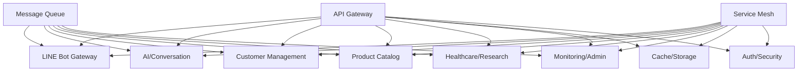

# Inter-Service Communication Patterns

## 🎯 Overview

This document defines the communication patterns, protocols, and best practices for inter-service communication in the LINE Bot microservices architecture. The system uses a hybrid approach combining **synchronous REST APIs** for immediate responses and **asynchronous message queues** for event-driven operations.

## 🏗️ Communication Architecture

### Communication Matrix



### Communication Types

| Pattern | Use Case | Protocol | Latency | Reliability |
|---------|----------|----------|---------|-------------|
| **Synchronous** | Immediate response needed | HTTP/REST | Low | High |
| **Asynchronous** | Event processing, notifications | Message Queue | Medium | Very High |
| **Streaming** | Real-time data, logs | WebSocket/SSE | Very Low | Medium |
| **Cache-First** | Frequently accessed data | Redis/HTTP | Very Low | High |

## 🔄 Synchronous Communication (REST APIs)

### HTTP Client Configuration

```javascript
// services/common/http-client.js
const axios = require('axios');
const CircuitBreaker = require('opossum');

class HTTPClient {
  constructor(serviceName, baseURL, options = {}) {
    this.serviceName = serviceName;
    this.baseURL = baseURL;
    
    // Configure axios instance
    this.client = axios.create({
      baseURL,
      timeout: options.timeout || 10000,
      headers: {
        'Content-Type': 'application/json',
        'User-Agent': `microservice/${serviceName}/1.0.0`
      }
    });
    
    // Setup interceptors
    this.setupInterceptors();
    
    // Configure circuit breaker
    this.circuitBreaker = new CircuitBreaker(this.makeRequest.bind(this), {
      timeout: options.timeout || 10000,
      errorThresholdPercentage: 50,
      resetTimeout: 30000,
      rollingCountTimeout: 10000,
      rollingCountBuckets: 10
    });
    
    this.setupCircuitBreakerEvents();
  }
  
  setupInterceptors() {
    // Request interceptor - add correlation ID and auth
    this.client.interceptors.request.use((config) => {
      // Add correlation ID for tracing
      config.headers['X-Correlation-ID'] = 
        config.headers['X-Correlation-ID'] || this.generateCorrelationId();
      
      // Add service authentication
      config.headers['X-Service-Name'] = this.serviceName;
      
      // Add timestamp
      config.headers['X-Request-Time'] = new Date().toISOString();
      
      return config;
    });
    
    // Response interceptor - logging and error handling
    this.client.interceptors.response.use(
      (response) => {
        this.logResponse(response);
        return response;
      },
      (error) => {
        this.logError(error);
        return Promise.reject(this.normalizeError(error));
      }
    );
  }
  
  setupCircuitBreakerEvents() {
    this.circuitBreaker.on('open', () => {
      console.warn(`Circuit breaker OPEN for ${this.serviceName}`);
    });
    
    this.circuitBreaker.on('halfOpen', () => {
      console.info(`Circuit breaker HALF-OPEN for ${this.serviceName}`);
    });
    
    this.circuitBreaker.on('close', () => {
      console.info(`Circuit breaker CLOSED for ${this.serviceName}`);
    });
  }
  
  async makeRequest(config) {
    return await this.client.request(config);
  }
  
  async get(path, params = {}, options = {}) {
    return await this.circuitBreaker.fire({
      method: 'GET',
      url: path,
      params,
      ...options
    });
  }
  
  async post(path, data = {}, options = {}) {
    return await this.circuitBreaker.fire({
      method: 'POST',
      url: path,
      data,
      ...options
    });
  }
  
  async put(path, data = {}, options = {}) {
    return await this.circuitBreaker.fire({
      method: 'PUT',
      url: path,
      data,
      ...options
    });
  }
  
  async delete(path, options = {}) {
    return await this.circuitBreaker.fire({
      method: 'DELETE',
      url: path,
      ...options
    });
  }
  
  generateCorrelationId() {
    return `${this.serviceName}-${Date.now()}-${Math.random().toString(36).substr(2, 9)}`;
  }
  
  logResponse(response) {
    const duration = Date.now() - new Date(response.config.headers['X-Request-Time']).getTime();
    console.info(`HTTP ${response.config.method.toUpperCase()} ${response.config.url} - ${response.status} - ${duration}ms`);
  }
  
  logError(error) {
    const correlationId = error.config?.headers['X-Correlation-ID'];
    console.error(`HTTP Error [${correlationId}]:`, {
      service: this.serviceName,
      url: error.config?.url,
      method: error.config?.method,
      status: error.response?.status,
      message: error.message
    });
  }
  
  normalizeError(error) {
    return {
      service: this.serviceName,
      code: error.response?.status || 'NETWORK_ERROR',
      message: error.response?.data?.message || error.message,
      correlationId: error.config?.headers['X-Correlation-ID'],
      timestamp: new Date().toISOString()
    };
  }
}

module.exports = HTTPClient;
```

### Service Client Implementations

#### AI Service Client
```javascript
// services/line-bot-gateway/clients/ai-service-client.js
const HTTPClient = require('../../common/http-client');

class AIServiceClient {
  constructor() {
    this.client = new HTTPClient(
      'line-bot-gateway',
      process.env.AI_SERVICE_URL || 'http://ai-conversation:3000',
      { timeout: 30000 } // Extended timeout for AI processing
    );
  }
  
  async generateResponse(userId, message, context = {}) {
    try {
      const response = await this.client.post('/ai/generate', {
        userId,
        message,
        context: {
          language: context.language || 'en',
          previousMessages: context.previousMessages || [],
          userProfile: context.userProfile || {},
          ...context
        },
        options: {
          provider: context.provider || 'deepSeek',
          maxTokens: context.maxTokens || 2000,
          temperature: context.temperature || 0.7
        }
      });
      
      return response.data;
    } catch (error) {
      console.error('AI Service Error:', error);
      
      // Fallback to simple response
      return {
        success: false,
        data: {
          response: "I'm having trouble processing your request. Please try again.",
          provider: 'fallback',
          confidence: 0.1
        },
        error: error.message
      };
    }
  }
  
  async getConversationHistory(userId, limit = 10) {
    try {
      const response = await this.client.get(`/conversation/${userId}`, {
        limit
      });
      
      return response.data;
    } catch (error) {
      console.error('Error fetching conversation history:', error);
      return { success: false, data: { messages: [] } };
    }
  }
  
  async getProviderStats() {
    try {
      const response = await this.client.get('/ai/providers/stats');
      return response.data;
    } catch (error) {
      console.error('Error fetching AI provider stats:', error);
      return { success: false, data: {} };
    }
  }
}

module.exports = AIServiceClient;
```

#### Customer Service Client
```javascript
// services/ai-conversation/clients/customer-service-client.js
const HTTPClient = require('../../common/http-client');

class CustomerServiceClient {
  constructor() {
    this.client = new HTTPClient(
      'ai-conversation',
      process.env.CUSTOMER_SERVICE_URL || 'http://customer-management:3000'
    );
  }
  
  async getCustomer(userId) {
    try {
      const response = await this.client.get(`/customers/${userId}`);
      return response.data;
    } catch (error) {
      if (error.code === 404) {
        // Customer not found, return default profile
        return {
          success: true,
          data: {
            lineUserId: userId,
            displayName: 'Customer',
            profile: {
              language: 'en',
              preferences: [],
              interests: []
            }
          }
        };
      }
      
      throw error;
    }
  }
  
  async updateCustomerProfile(userId, profileUpdates) {
    try {
      const response = await this.client.put(`/customers/${userId}`, profileUpdates);
      return response.data;
    } catch (error) {
      console.error('Error updating customer profile:', error);
      throw error;
    }
  }
  
  async recordCustomerActivity(userId, activity) {
    try {
      const response = await this.client.post(`/customers/${userId}/activity`, {
        type: activity.type,
        data: activity.data,
        timestamp: new Date().toISOString(),
        source: 'ai-conversation'
      });
      
      return response.data;
    } catch (error) {
      // Non-blocking operation, log but don't throw
      console.warn('Failed to record customer activity:', error);
      return { success: false };
    }
  }
}

module.exports = CustomerServiceClient;
```

#### Product Service Client
```javascript
// services/ai-conversation/clients/product-service-client.js
const HTTPClient = require('../../common/http-client');

class ProductServiceClient {
  constructor() {
    this.client = new HTTPClient(
      'ai-conversation',
      process.env.PRODUCT_SERVICE_URL || 'http://product-catalog:3000'
    );
  }
  
  async searchProducts(query, options = {}) {
    try {
      const response = await this.client.get('/products', {
        search: query,
        language: options.language || 'en',
        category: options.category,
        limit: options.limit || 10,
        page: options.page || 1
      });
      
      return response.data;
    } catch (error) {
      console.error('Error searching products:', error);
      return {
        success: false,
        data: { items: [], pagination: { total: 0 } }
      };
    }
  }
  
  async getProduct(productId, language = 'en') {
    try {
      const response = await this.client.get(`/products/${productId}`, {
        language
      });
      
      return response.data;
    } catch (error) {
      console.error(`Error fetching product ${productId}:`, error);
      throw error;
    }
  }
  
  async getProductRecommendations(userId, options = {}) {
    try {
      const response = await this.client.get('/products/recommendations', {
        userId,
        limit: options.limit || 5,
        category: options.category,
        language: options.language || 'en'
      });
      
      return response.data;
    } catch (error) {
      console.error('Error fetching product recommendations:', error);
      return {
        success: false,
        data: { items: [] }
      };
    }
  }
}

module.exports = ProductServiceClient;
```

## 📨 Asynchronous Communication (Message Queue)

### Message Queue Configuration

```javascript
// services/common/message-queue.js
const Redis = require('redis');
const EventEmitter = require('events');

class MessageQueue extends EventEmitter {
  constructor(options = {}) {
    super();
    
    this.redisClient = Redis.createClient({
      url: process.env.REDIS_URL || 'redis://redis:6379',
      retry_strategy: (options) => {
        if (options.error && options.error.code === 'ECONNREFUSED') {
          return new Error('Redis server connection refused');
        }
        if (options.total_retry_time > 1000 * 60 * 60) {
          return new Error('Retry time exhausted');
        }
        if (options.attempt > 10) {
          return undefined;
        }
        return Math.min(options.attempt * 100, 3000);
      }
    });
    
    this.publisherClient = this.redisClient.duplicate();
    this.subscriberClient = this.redisClient.duplicate();
    
    this.serviceName = options.serviceName || 'unknown';
    this.subscribers = new Map();
    
    this.setupConnections();
  }
  
  async setupConnections() {
    try {
      await this.redisClient.connect();
      await this.publisherClient.connect();
      await this.subscriberClient.connect();
      
      console.log(`Message queue connected for service: ${this.serviceName}`);
      
      // Setup error handlers
      this.redisClient.on('error', this.handleError.bind(this));
      this.publisherClient.on('error', this.handleError.bind(this));
      this.subscriberClient.on('error', this.handleError.bind(this));
      
    } catch (error) {
      console.error('Failed to connect to Redis:', error);
      throw error;
    }
  }
  
  async publish(channel, message, options = {}) {
    try {
      const messagePayload = {
        id: this.generateMessageId(),
        timestamp: new Date().toISOString(),
        source: this.serviceName,
        correlationId: options.correlationId || this.generateCorrelationId(),
        data: message,
        metadata: {
          version: '1.0.0',
          contentType: 'application/json',
          ...options.metadata
        }
      };
      
      const serializedMessage = JSON.stringify(messagePayload);
      
      // Publish to channel
      await this.publisherClient.publish(channel, serializedMessage);
      
      // Log publication
      console.info(`Published message to ${channel}:`, {
        messageId: messagePayload.id,
        correlationId: messagePayload.correlationId,
        source: this.serviceName
      });
      
      // Store in stream for replay capability (optional)
      if (options.persistent) {
        await this.publisherClient.xAdd(
          `stream:${channel}`,
          '*',
          'message',
          serializedMessage
        );
      }
      
      return messagePayload.id;
    } catch (error) {
      console.error(`Failed to publish message to ${channel}:`, error);
      throw error;
    }
  }
  
  async subscribe(channel, handler, options = {}) {
    try {
      if (this.subscribers.has(channel)) {
        console.warn(`Already subscribed to channel: ${channel}`);
        return;
      }
      
      const wrappedHandler = async (message, channelName) => {
        try {
          const parsedMessage = JSON.parse(message);
          
          // Add processing metadata
          parsedMessage.processedAt = new Date().toISOString();
          parsedMessage.processedBy = this.serviceName;
          
          // Log message reception
          console.info(`Received message from ${channelName}:`, {
            messageId: parsedMessage.id,
            correlationId: parsedMessage.correlationId,
            source: parsedMessage.source
          });
          
          // Call handler with parsed message
          await handler(parsedMessage.data, parsedMessage);
          
        } catch (error) {
          console.error(`Error processing message from ${channelName}:`, error);
          
          // Send to dead letter queue if configured
          if (options.deadLetterQueue) {
            await this.sendToDeadLetterQueue(channel, message, error);
          }
          
          // Emit error event
          this.emit('error', {
            channel: channelName,
            message,
            error,
            handler: handler.name
          });
        }
      };
      
      // Subscribe to channel
      await this.subscriberClient.subscribe(channel, wrappedHandler);
      
      // Store subscription info
      this.subscribers.set(channel, {
        handler: wrappedHandler,
        originalHandler: handler,
        options
      });
      
      console.info(`Subscribed to channel: ${channel}`);
      
    } catch (error) {
      console.error(`Failed to subscribe to ${channel}:`, error);
      throw error;
    }
  }
  
  async unsubscribe(channel) {
    try {
      if (!this.subscribers.has(channel)) {
        console.warn(`Not subscribed to channel: ${channel}`);
        return;
      }
      
      await this.subscriberClient.unsubscribe(channel);
      this.subscribers.delete(channel);
      
      console.info(`Unsubscribed from channel: ${channel}`);
      
    } catch (error) {
      console.error(`Failed to unsubscribe from ${channel}:`, error);
      throw error;
    }
  }
  
  async sendToDeadLetterQueue(originalChannel, message, error) {
    const deadLetterChannel = `dlq:${originalChannel}`;
    
    const dlqMessage = {
      originalChannel,
      originalMessage: message,
      error: {
        message: error.message,
        stack: error.stack,
        timestamp: new Date().toISOString()
      },
      attemptCount: 1,
      service: this.serviceName
    };
    
    await this.publish(deadLetterChannel, dlqMessage, { persistent: true });
  }
  
  generateMessageId() {
    return `msg-${Date.now()}-${Math.random().toString(36).substr(2, 9)}`;
  }
  
  generateCorrelationId() {
    return `corr-${Date.now()}-${Math.random().toString(36).substr(2, 9)}`;
  }
  
  handleError(error) {
    console.error('Redis connection error:', error);
    this.emit('connectionError', error);
  }
  
  async close() {
    try {
      // Unsubscribe from all channels
      for (const channel of this.subscribers.keys()) {
        await this.unsubscribe(channel);
      }
      
      // Close connections
      await this.redisClient.quit();
      await this.publisherClient.quit();
      await this.subscriberClient.quit();
      
      console.log('Message queue connections closed');
    } catch (error) {
      console.error('Error closing message queue connections:', error);
    }
  }
}

module.exports = MessageQueue;
```

### Event-Driven Patterns

#### Customer Events
```javascript
// services/customer-management/events/customer-events.js
class CustomerEventPublisher {
  constructor(messageQueue) {
    this.messageQueue = messageQueue;
  }
  
  async publishCustomerCreated(customer) {
    await this.messageQueue.publish('customer.events', {
      type: 'customer.created',
      userId: customer.lineUserId,
      data: {
        displayName: customer.displayName,
        profile: customer.profile,
        createdAt: customer.createdAt
      }
    }, {
      correlationId: `customer-${customer.lineUserId}-${Date.now()}`,
      persistent: true
    });
  }
  
  async publishCustomerUpdated(userId, changes) {
    await this.messageQueue.publish('customer.events', {
      type: 'customer.updated',
      userId,
      data: {
        changes,
        updatedAt: new Date().toISOString()
      }
    });
  }
  
  async publishCustomerActivity(userId, activity) {
    await this.messageQueue.publish('customer.activity', {
      type: 'customer.activity',
      userId,
      data: {
        activityType: activity.type,
        details: activity.data,
        timestamp: activity.timestamp,
        source: activity.source
      }
    });
  }
}

// Event subscriber in AI service
class CustomerEventSubscriber {
  constructor(messageQueue) {
    this.messageQueue = messageQueue;
    this.setupSubscriptions();
  }
  
  async setupSubscriptions() {
    // Subscribe to customer events
    await this.messageQueue.subscribe('customer.events', 
      this.handleCustomerEvent.bind(this)
    );
    
    // Subscribe to customer activity
    await this.messageQueue.subscribe('customer.activity',
      this.handleCustomerActivity.bind(this)
    );
  }
  
  async handleCustomerEvent(data, message) {
    console.log(`Processing customer event: ${data.type}`);
    
    switch (data.type) {
      case 'customer.created':
        await this.onCustomerCreated(data);
        break;
      case 'customer.updated':
        await this.onCustomerUpdated(data);
        break;
      default:
        console.warn(`Unknown customer event type: ${data.type}`);
    }
  }
  
  async handleCustomerActivity(data, message) {
    // Update conversation context based on customer activity
    if (data.activityType === 'product_viewed') {
      await this.updateConversationContext(data.userId, {
        recentProductViews: data.details.productIds
      });
    }
  }
  
  async onCustomerCreated(data) {
    // Initialize AI conversation session for new customer
    await this.initializeConversationSession(data.userId, {
      displayName: data.data.displayName,
      preferences: data.data.profile.preferences,
      language: data.data.profile.language
    });
  }
  
  async onCustomerUpdated(data) {
    // Update conversation context with new customer data
    await this.updateConversationContext(data.userId, data.data.changes);
  }
}
```

#### AI Response Events
```javascript
// services/ai-conversation/events/ai-events.js
class AIEventPublisher {
  constructor(messageQueue) {
    this.messageQueue = messageQueue;
  }
  
  async publishResponseGenerated(response) {
    await this.messageQueue.publish('ai.events', {
      type: 'ai.response.generated',
      userId: response.userId,
      data: {
        provider: response.provider,
        tokensUsed: response.tokensUsed,
        processingTime: response.processingTime,
        confidence: response.confidence,
        intent: response.intent,
        entities: response.entities,
        timestamp: new Date().toISOString()
      }
    });
  }
  
  async publishProviderFailure(provider, error, context) {
    await this.messageQueue.publish('ai.alerts', {
      type: 'ai.provider.failure',
      provider,
      data: {
        error: error.message,
        context,
        timestamp: new Date().toISOString(),
        severity: 'high'
      }
    });
  }
  
  async publishConversationCompleted(userId, sessionData) {
    await this.messageQueue.publish('conversation.events', {
      type: 'conversation.completed',
      userId,
      data: {
        messageCount: sessionData.messageCount,
        duration: sessionData.duration,
        satisfaction: sessionData.satisfaction,
        resolution: sessionData.resolution,
        completedAt: new Date().toISOString()
      }
    });
  }
}
```

## 🔀 Service Orchestration Patterns

### Saga Pattern Implementation

```javascript
// services/common/saga-orchestrator.js
class SagaOrchestrator {
  constructor(messageQueue) {
    this.messageQueue = messageQueue;
    this.activeSagas = new Map();
    this.sagaDefinitions = new Map();
  }
  
  defineSaga(sagaType, definition) {
    this.sagaDefinitions.set(sagaType, definition);
  }
  
  async startSaga(sagaType, sagaId, initialData) {
    const definition = this.sagaDefinitions.get(sagaType);
    if (!definition) {
      throw new Error(`Saga type ${sagaType} not found`);
    }
    
    const saga = {
      id: sagaId,
      type: sagaType,
      status: 'started',
      currentStep: 0,
      data: initialData,
      completedSteps: [],
      compensations: [],
      startedAt: new Date().toISOString()
    };
    
    this.activeSagas.set(sagaId, saga);
    
    // Execute first step
    await this.executeNextStep(sagaId);
    
    return sagaId;
  }
  
  async executeNextStep(sagaId) {
    const saga = this.activeSagas.get(sagaId);
    if (!saga) {
      throw new Error(`Saga ${sagaId} not found`);
    }
    
    const definition = this.sagaDefinitions.get(saga.type);
    const step = definition.steps[saga.currentStep];
    
    if (!step) {
      // Saga completed
      saga.status = 'completed';
      saga.completedAt = new Date().toISOString();
      return;
    }
    
    try {
      console.log(`Executing saga ${sagaId} step ${saga.currentStep}: ${step.name}`);
      
      // Execute step
      const result = await step.execute(saga.data);
      
      // Record successful step
      saga.completedSteps.push({
        stepIndex: saga.currentStep,
        stepName: step.name,
        result,
        completedAt: new Date().toISOString()
      });
      
      // Store compensation function if provided
      if (step.compensate) {
        saga.compensations.push({
          stepIndex: saga.currentStep,
          compensate: step.compensate,
          data: result
        });
      }
      
      // Move to next step
      saga.currentStep++;
      saga.data = { ...saga.data, ...result };
      
      // Continue with next step
      await this.executeNextStep(sagaId);
      
    } catch (error) {
      console.error(`Saga ${sagaId} step ${saga.currentStep} failed:`, error);
      
      // Start compensation
      await this.compensateSaga(sagaId, error);
    }
  }
  
  async compensateSaga(sagaId, originalError) {
    const saga = this.activeSagas.get(sagaId);
    saga.status = 'compensating';
    saga.error = originalError.message;
    
    console.log(`Starting compensation for saga ${sagaId}`);
    
    // Execute compensations in reverse order
    for (let i = saga.compensations.length - 1; i >= 0; i--) {
      const compensation = saga.compensations[i];
      
      try {
        console.log(`Compensating step ${compensation.stepIndex}`);
        await compensation.compensate(compensation.data);
      } catch (compensationError) {
        console.error(`Compensation failed for step ${compensation.stepIndex}:`, compensationError);
        // Continue with other compensations
      }
    }
    
    saga.status = 'failed';
    saga.failedAt = new Date().toISOString();
    
    // Publish saga failure event
    await this.messageQueue.publish('saga.events', {
      type: 'saga.failed',
      sagaId,
      sagaType: saga.type,
      error: originalError.message,
      compensationStatus: 'completed'
    });
  }
}

// Example saga definition for customer onboarding
const customerOnboardingSaga = {
  steps: [
    {
      name: 'createCustomerProfile',
      execute: async (data) => {
        const customer = await customerService.createCustomer(data.customerData);
        return { customerId: customer.id };
      },
      compensate: async (result) => {
        await customerService.deleteCustomer(result.customerId);
      }
    },
    {
      name: 'initializeConversation',
      execute: async (data) => {
        const conversation = await conversationService.initialize(data.customerId);
        return { conversationId: conversation.id };
      },
      compensate: async (result) => {
        await conversationService.close(result.conversationId);
      }
    },
    {
      name: 'sendWelcomeMessage',
      execute: async (data) => {
        await messagingService.sendWelcome(data.customerId, data.conversationId);
        return { welcomeSent: true };
      },
      compensate: async (result) => {
        // No compensation needed for welcome message
      }
    }
  ]
};
```

### Request-Response Pattern with Timeout

```javascript
// services/common/request-response.js
class RequestResponseManager {
  constructor(messageQueue) {
    this.messageQueue = messageQueue;
    this.pendingRequests = new Map();
    this.responseChannel = `responses:${process.env.SERVICE_NAME}`;
    
    // Subscribe to responses
    this.messageQueue.subscribe(this.responseChannel, this.handleResponse.bind(this));
  }
  
  async sendRequest(targetService, operation, data, timeout = 10000) {
    const requestId = this.generateRequestId();
    const requestChannel = `requests:${targetService}`;
    
    // Create promise for response
    const responsePromise = new Promise((resolve, reject) => {
      const timer = setTimeout(() => {
        this.pendingRequests.delete(requestId);
        reject(new Error(`Request ${requestId} to ${targetService} timed out`));
      }, timeout);
      
      this.pendingRequests.set(requestId, {
        resolve,
        reject,
        timer,
        targetService,
        operation,
        sentAt: new Date().toISOString()
      });
    });
    
    // Send request
    await this.messageQueue.publish(requestChannel, {
      requestId,
      operation,
      data,
      replyTo: this.responseChannel,
      sentAt: new Date().toISOString()
    });
    
    return responsePromise;
  }
  
  async handleResponse(responseData, message) {
    const { requestId, success, data, error } = responseData;
    
    const pendingRequest = this.pendingRequests.get(requestId);
    if (!pendingRequest) {
      console.warn(`Received response for unknown request: ${requestId}`);
      return;
    }
    
    // Clear timeout
    clearTimeout(pendingRequest.timer);
    this.pendingRequests.delete(requestId);
    
    // Resolve or reject promise
    if (success) {
      pendingRequest.resolve(data);
    } else {
      pendingRequest.reject(new Error(error));
    }
  }
  
  // Method for services to handle incoming requests
  async handleRequest(requestData, message) {
    const { requestId, operation, data, replyTo } = requestData;
    
    try {
      // Execute operation
      const result = await this.executeOperation(operation, data);
      
      // Send success response
      await this.messageQueue.publish(replyTo, {
        requestId,
        success: true,
        data: result
      });
      
    } catch (error) {
      // Send error response
      await this.messageQueue.publish(replyTo, {
        requestId,
        success: false,
        error: error.message
      });
    }
  }
  
  generateRequestId() {
    return `req-${Date.now()}-${Math.random().toString(36).substr(2, 9)}`;
  }
}
```

## 📊 Communication Monitoring & Observability

### Distributed Tracing

```javascript
// services/common/tracing.js
class DistributedTracing {
  constructor(serviceName) {
    this.serviceName = serviceName;
    this.activeTraces = new Map();
  }
  
  startTrace(operationName, parentTraceId = null) {
    const traceId = parentTraceId || this.generateTraceId();
    const spanId = this.generateSpanId();
    
    const trace = {
      traceId,
      spanId,
      parentSpanId: parentTraceId ? this.extractSpanId(parentTraceId) : null,
      operationName,
      serviceName: this.serviceName,
      startTime: Date.now(),
      tags: new Map(),
      logs: []
    };
    
    this.activeTraces.set(spanId, trace);
    return { traceId: `${traceId}:${spanId}`, spanId };
  }
  
  addTag(spanId, key, value) {
    const trace = this.activeTraces.get(spanId);
    if (trace) {
      trace.tags.set(key, value);
    }
  }
  
  addLog(spanId, message, data = {}) {
    const trace = this.activeTraces.get(spanId);
    if (trace) {
      trace.logs.push({
        timestamp: Date.now(),
        message,
        data
      });
    }
  }
  
  finishTrace(spanId, error = null) {
    const trace = this.activeTraces.get(spanId);
    if (!trace) return;
    
    trace.endTime = Date.now();
    trace.duration = trace.endTime - trace.startTime;
    trace.success = !error;
    
    if (error) {
      trace.error = {
        message: error.message,
        stack: error.stack
      };
    }
    
    // Send trace to monitoring system
    this.sendTraceToMonitoring(trace);
    
    this.activeTraces.delete(spanId);
  }
  
  async sendTraceToMonitoring(trace) {
    // Send to monitoring service or external tracing system
    try {
      await fetch(`${process.env.MONITORING_SERVICE_URL}/traces`, {
        method: 'POST',
        headers: { 'Content-Type': 'application/json' },
        body: JSON.stringify(trace)
      });
    } catch (error) {
      console.error('Failed to send trace:', error);
    }
  }
  
  generateTraceId() {
    return Math.random().toString(36).substr(2, 16);
  }
  
  generateSpanId() {
    return Math.random().toString(36).substr(2, 8);
  }
  
  extractSpanId(traceId) {
    return traceId.split(':')[1];
  }
}
```

### Performance Metrics Collection

```javascript
// services/common/metrics-collector.js
class MetricsCollector {
  constructor(serviceName) {
    this.serviceName = serviceName;
    this.metrics = {
      httpRequests: new Map(),
      messageQueue: new Map(),
      circuitBreaker: new Map(),
      database: new Map()
    };
    
    // Start metrics reporting
    setInterval(() => this.reportMetrics(), 60000); // Every minute
  }
  
  recordHTTPRequest(method, path, statusCode, duration) {
    const key = `${method}:${path}`;
    
    if (!this.metrics.httpRequests.has(key)) {
      this.metrics.httpRequests.set(key, {
        method,
        path,
        totalRequests: 0,
        successCount: 0,
        errorCount: 0,
        totalDuration: 0,
        maxDuration: 0,
        minDuration: Infinity
      });
    }
    
    const metric = this.metrics.httpRequests.get(key);
    metric.totalRequests++;
    metric.totalDuration += duration;
    metric.maxDuration = Math.max(metric.maxDuration, duration);
    metric.minDuration = Math.min(metric.minDuration, duration);
    
    if (statusCode >= 200 && statusCode < 400) {
      metric.successCount++;
    } else {
      metric.errorCount++;
    }
  }
  
  recordMessageQueueOperation(operation, channel, success, duration) {
    const key = `${operation}:${channel}`;
    
    if (!this.metrics.messageQueue.has(key)) {
      this.metrics.messageQueue.set(key, {
        operation,
        channel,
        totalOperations: 0,
        successCount: 0,
        errorCount: 0,
        totalDuration: 0,
        avgDuration: 0
      });
    }
    
    const metric = this.metrics.messageQueue.get(key);
    metric.totalOperations++;
    metric.totalDuration += duration;
    metric.avgDuration = metric.totalDuration / metric.totalOperations;
    
    if (success) {
      metric.successCount++;
    } else {
      metric.errorCount++;
    }
  }
  
  recordCircuitBreakerEvent(service, event) {
    const key = service;
    
    if (!this.metrics.circuitBreaker.has(key)) {
      this.metrics.circuitBreaker.set(key, {
        service,
        openCount: 0,
        halfOpenCount: 0,
        closeCount: 0,
        lastEvent: null,
        lastEventTime: null
      });
    }
    
    const metric = this.metrics.circuitBreaker.get(key);
    metric[`${event}Count`]++;
    metric.lastEvent = event;
    metric.lastEventTime = new Date().toISOString();
  }
  
  async reportMetrics() {
    const report = {
      service: this.serviceName,
      timestamp: new Date().toISOString(),
      httpRequests: Array.from(this.metrics.httpRequests.values()),
      messageQueue: Array.from(this.metrics.messageQueue.values()),
      circuitBreaker: Array.from(this.metrics.circuitBreaker.values()),
      system: await this.getSystemMetrics()
    };
    
    try {
      // Send to monitoring service
      await fetch(`${process.env.MONITORING_SERVICE_URL}/metrics`, {
        method: 'POST',
        headers: { 'Content-Type': 'application/json' },
        body: JSON.stringify(report)
      });
      
      // Reset counters for next period
      this.resetMetrics();
      
    } catch (error) {
      console.error('Failed to report metrics:', error);
    }
  }
  
  async getSystemMetrics() {
    const process = require('process');
    const os = require('os');
    
    return {
      memory: {
        rss: process.memoryUsage().rss,
        heapUsed: process.memoryUsage().heapUsed,
        heapTotal: process.memoryUsage().heapTotal,
        external: process.memoryUsage().external
      },
      cpu: {
        usage: process.cpuUsage(),
        loadAverage: os.loadavg()
      },
      uptime: process.uptime(),
      version: process.version
    };
  }
  
  resetMetrics() {
    this.metrics.httpRequests.clear();
    this.metrics.messageQueue.clear();
    // Don't reset circuit breaker metrics as they're state-based
  }
}
```

## 🔧 Service Discovery & Health Checks

### Service Registry
```javascript
// services/common/service-registry.js
class ServiceRegistry {
  constructor(redisClient) {
    this.redis = redisClient;
    this.serviceName = process.env.SERVICE_NAME;
    this.servicePort = process.env.SERVICE_PORT || 3000;
    this.serviceHost = process.env.SERVICE_HOST || 'localhost';
    this.registrationTTL = 30; // seconds
  }
  
  async register() {
    const serviceInfo = {
      name: this.serviceName,
      host: this.serviceHost,
      port: this.servicePort,
      status: 'healthy',
      registeredAt: new Date().toISOString(),
      metadata: {
        version: process.env.npm_package_version || '1.0.0',
        environment: process.env.NODE_ENV || 'development'
      }
    };
    
    const key = `service:${this.serviceName}:${this.serviceHost}:${this.servicePort}`;
    
    // Register service with TTL
    await this.redis.setEx(key, this.registrationTTL, JSON.stringify(serviceInfo));
    
    // Start periodic heartbeat
    this.startHeartbeat();
    
    console.log(`Service ${this.serviceName} registered at ${this.serviceHost}:${this.servicePort}`);
  }
  
  startHeartbeat() {
    this.heartbeatInterval = setInterval(async () => {
      try {
        await this.register(); // Re-register to extend TTL
      } catch (error) {
        console.error('Failed to send heartbeat:', error);
      }
    }, (this.registrationTTL * 1000) / 2); // Heartbeat at half TTL
  }
  
  async discover(serviceName) {
    const pattern = `service:${serviceName}:*`;
    const keys = await this.redis.keys(pattern);
    
    const services = [];
    for (const key of keys) {
      try {
        const serviceInfo = JSON.parse(await this.redis.get(key));
        if (serviceInfo.status === 'healthy') {
          services.push(serviceInfo);
        }
      } catch (error) {
        console.warn(`Failed to parse service info for key ${key}:`, error);
      }
    }
    
    return services;
  }
  
  async deregister() {
    const key = `service:${this.serviceName}:${this.serviceHost}:${this.servicePort}`;
    await this.redis.del(key);
    
    if (this.heartbeatInterval) {
      clearInterval(this.heartbeatInterval);
    }
    
    console.log(`Service ${this.serviceName} deregistered`);
  }
}
```

This comprehensive inter-service communication framework ensures reliable, scalable, and observable communication between microservices while maintaining fault tolerance and performance optimization.