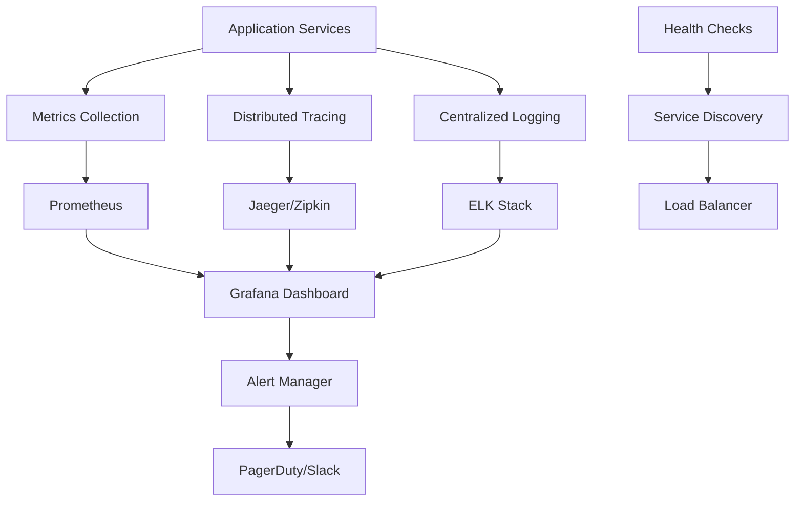

# Monitoring & Observability Strategy

## 🎯 Overview

This document outlines the comprehensive monitoring and observability strategy for the LINE Bot microservices architecture. The system implements **three pillars of observability**: metrics, logs, and distributed tracing, with automated alerting and performance optimization.

## 📊 Observability Architecture

### Three Pillars Implementation



## 🔍 Metrics Collection System

### Prometheus Configuration

```yaml
# infrastructure/prometheus/prometheus.yml
global:
  scrape_interval: 15s
  evaluation_interval: 15s
  external_labels:
    cluster: 'line-bot-microservices'
    environment: 'production'

rule_files:
  - "alert_rules.yml"

scrape_configs:
  # LINE Bot Gateway Service
  - job_name: 'line-bot-gateway'
    static_configs:
      - targets: ['line-bot-gateway:3000']
    metrics_path: '/metrics'
    scrape_interval: 10s
    scrape_timeout: 5s

  # AI/Conversation Service
  - job_name: 'ai-conversation'
    static_configs:
      - targets: ['ai-conversation:3000']
    metrics_path: '/metrics'
    scrape_interval: 15s

  # Customer Management Service
  - job_name: 'customer-management'
    static_configs:
      - targets: ['customer-management:3000']
    metrics_path: '/metrics'
    scrape_interval: 15s

  # Product Catalog Service
  - job_name: 'product-catalog'
    static_configs:
      - targets: ['product-catalog:3000']
    metrics_path: '/metrics'
    scrape_interval: 15s

  # Healthcare/Research Service
  - job_name: 'healthcare-research'
    static_configs:
      - targets: ['healthcare-research:3000']
    metrics_path: '/metrics'
    scrape_interval: 15s

  # Infrastructure Services
  - job_name: 'redis'
    static_configs:
      - targets: ['redis:6379']
    metrics_path: '/metrics'

  - job_name: 'mongodb'
    static_configs:
      - targets: ['conversations-db:27017', 'customers-db:27019', 'products-db:27020']

  # API Gateway (NGINX)
  - job_name: 'api-gateway'
    static_configs:
      - targets: ['api-gateway:9113']
    metrics_path: '/metrics'

alerting:
  alertmanagers:
    - static_configs:
        - targets:
          - alertmanager:9093

remote_write:
  - url: "http://monitoring-admin:3000/prometheus/write"
    queue_config:
      max_samples_per_send: 1000
      batch_send_deadline: 5s
```

### Application Metrics Instrumentation

```javascript
// services/common/metrics.js
const promClient = require('prom-client');

class ApplicationMetrics {
  constructor(serviceName) {
    this.serviceName = serviceName;
    this.register = new promClient.Registry();
    
    // Add default metrics
    promClient.collectDefaultMetrics({
      register: this.register,
      prefix: `${serviceName}_`,
      timeout: 5000
    });
    
    this.initializeCustomMetrics();
  }
  
  initializeCustomMetrics() {
    // HTTP request metrics
    this.httpRequestDuration = new promClient.Histogram({
      name: `${this.serviceName}_http_request_duration_seconds`,
      help: 'Duration of HTTP requests in seconds',
      labelNames: ['method', 'route', 'status_code'],
      buckets: [0.01, 0.05, 0.1, 0.5, 1, 2, 5, 10]
    });
    
    this.httpRequestTotal = new promClient.Counter({
      name: `${this.serviceName}_http_requests_total`,
      help: 'Total number of HTTP requests',
      labelNames: ['method', 'route', 'status_code']
    });
    
    // Business metrics
    this.businessOperations = new promClient.Counter({
      name: `${this.serviceName}_business_operations_total`,
      help: 'Total number of business operations',
      labelNames: ['operation_type', 'status']
    });
    
    this.activeConnections = new promClient.Gauge({
      name: `${this.serviceName}_active_connections`,
      help: 'Number of active connections',
      labelNames: ['connection_type']
    });
    
    // Message queue metrics
    this.messageQueueOperations = new promClient.Counter({
      name: `${this.serviceName}_message_queue_operations_total`,
      help: 'Total number of message queue operations',
      labelNames: ['operation', 'channel', 'status']
    });
    
    this.messageProcessingDuration = new promClient.Histogram({
      name: `${this.serviceName}_message_processing_duration_seconds`,
      help: 'Duration of message processing in seconds',
      labelNames: ['channel', 'message_type'],
      buckets: [0.001, 0.01, 0.1, 0.5, 1, 2, 5]
    });
    
    // Database metrics
    this.databaseOperations = new promClient.Counter({
      name: `${this.serviceName}_database_operations_total`,
      help: 'Total number of database operations',
      labelNames: ['operation', 'collection', 'status']
    });
    
    this.databaseConnectionPool = new promClient.Gauge({
      name: `${this.serviceName}_database_connection_pool`,
      help: 'Database connection pool metrics',
      labelNames: ['pool_type', 'status']
    });
    
    // Circuit breaker metrics
    this.circuitBreakerEvents = new promClient.Counter({
      name: `${this.serviceName}_circuit_breaker_events_total`,
      help: 'Total number of circuit breaker events',
      labelNames: ['service', 'event']
    });
    
    // Register all metrics
    this.register.registerMetric(this.httpRequestDuration);
    this.register.registerMetric(this.httpRequestTotal);
    this.register.registerMetric(this.businessOperations);
    this.register.registerMetric(this.activeConnections);
    this.register.registerMetric(this.messageQueueOperations);
    this.register.registerMetric(this.messageProcessingDuration);
    this.register.registerMetric(this.databaseOperations);
    this.register.registerMetric(this.databaseConnectionPool);
    this.register.registerMetric(this.circuitBreakerEvents);
  }
  
  // HTTP metrics recording
  recordHTTPRequest(method, route, statusCode, duration) {
    const labels = { method, route, status_code: statusCode };
    
    this.httpRequestDuration.observe(labels, duration / 1000);
    this.httpRequestTotal.inc(labels);
  }
  
  // Business metrics recording
  recordBusinessOperation(operationType, status = 'success') {
    this.businessOperations.inc({ operation_type: operationType, status });
  }
  
  // Message queue metrics recording
  recordMessageQueueOperation(operation, channel, status, duration) {
    this.messageQueueOperations.inc({ operation, channel, status });
    
    if (duration !== undefined) {
      this.messageProcessingDuration.observe(
        { channel, message_type: operation },
        duration / 1000
      );
    }
  }
  
  // Database metrics recording
  recordDatabaseOperation(operation, collection, status, duration) {
    this.databaseOperations.inc({ operation, collection, status });
  }
  
  // Circuit breaker metrics recording
  recordCircuitBreakerEvent(service, event) {
    this.circuitBreakerEvents.inc({ service, event });
  }
  
  // Connection tracking
  setActiveConnections(connectionType, count) {
    this.activeConnections.set({ connection_type: connectionType }, count);
  }
  
  // Metrics endpoint
  getMetrics() {
    return this.register.metrics();
  }
}

module.exports = ApplicationMetrics;
```

### Service-Specific Metrics

#### AI/Conversation Service Metrics
```javascript
// services/ai-conversation/metrics/ai-metrics.js
class AIServiceMetrics extends ApplicationMetrics {
  constructor() {
    super('ai_conversation');
    this.initializeAIMetrics();
  }
  
  initializeAIMetrics() {
    // AI provider metrics
    this.aiRequests = new promClient.Counter({
      name: 'ai_conversation_ai_requests_total',
      help: 'Total number of AI requests',
      labelNames: ['provider', 'status']
    });
    
    this.aiResponseTime = new promClient.Histogram({
      name: 'ai_conversation_ai_response_time_seconds',
      help: 'AI response time in seconds',
      labelNames: ['provider'],
      buckets: [0.5, 1, 2, 5, 10, 15, 30]
    });
    
    this.tokensUsed = new promClient.Counter({
      name: 'ai_conversation_tokens_used_total',
      help: 'Total number of tokens used',
      labelNames: ['provider', 'operation']
    });
    
    this.conversationSessions = new promClient.Gauge({
      name: 'ai_conversation_active_sessions',
      help: 'Number of active conversation sessions'
    });
    
    this.register.registerMetric(this.aiRequests);
    this.register.registerMetric(this.aiResponseTime);
    this.register.registerMetric(this.tokensUsed);
    this.register.registerMetric(this.conversationSessions);
  }
  
  recordAIRequest(provider, status, responseTime, tokensUsed = 0) {
    this.aiRequests.inc({ provider, status });
    this.aiResponseTime.observe({ provider }, responseTime / 1000);
    
    if (tokensUsed > 0) {
      this.tokensUsed.inc({ provider, operation: 'generation' }, tokensUsed);
    }
  }
  
  setActiveConversationSessions(count) {
    this.conversationSessions.set(count);
  }
}
```

#### Customer Management Service Metrics
```javascript
// services/customer-management/metrics/customer-metrics.js
class CustomerServiceMetrics extends ApplicationMetrics {
  constructor() {
    super('customer_management');
    this.initializeCustomerMetrics();
  }
  
  initializeCustomerMetrics() {
    // Customer metrics
    this.customerOperations = new promClient.Counter({
      name: 'customer_management_customer_operations_total',
      help: 'Total number of customer operations',
      labelNames: ['operation', 'status']
    });
    
    this.totalCustomers = new promClient.Gauge({
      name: 'customer_management_total_customers',
      help: 'Total number of customers'
    });
    
    this.activeCustomers = new promClient.Gauge({
      name: 'customer_management_active_customers_24h',
      help: 'Number of active customers in last 24 hours'
    });
    
    this.customerEngagement = new promClient.Histogram({
      name: 'customer_management_engagement_score',
      help: 'Customer engagement score distribution',
      buckets: [0.1, 0.2, 0.3, 0.4, 0.5, 0.6, 0.7, 0.8, 0.9, 1.0]
    });
    
    this.register.registerMetric(this.customerOperations);
    this.register.registerMetric(this.totalCustomers);
    this.register.registerMetric(this.activeCustomers);
    this.register.registerMetric(this.customerEngagement);
  }
  
  recordCustomerOperation(operation, status = 'success') {
    this.customerOperations.inc({ operation, status });
  }
  
  updateCustomerCounts(total, active) {
    this.totalCustomers.set(total);
    this.activeCustomers.set(active);
  }
  
  recordEngagementScore(score) {
    this.customerEngagement.observe(score);
  }
}
```

## 📝 Centralized Logging System

### ELK Stack Configuration

#### Elasticsearch Configuration
```yaml
# infrastructure/elasticsearch/elasticsearch.yml
cluster.name: "line-bot-logs"
node.name: "elasticsearch-node-1"
path.data: /usr/share/elasticsearch/data
path.logs: /usr/share/elasticsearch/logs
network.host: 0.0.0.0
http.port: 9200
discovery.type: single-node

# Index settings
index.number_of_shards: 1
index.number_of_replicas: 0
indices.query.bool.max_clause_count: 10000

# Memory settings
bootstrap.memory_lock: false
```

#### Logstash Configuration
```ruby
# infrastructure/logstash/pipeline/logstash.conf
input {
  beats {
    port => 5044
  }
  
  tcp {
    port => 5000
    codec => json_lines
  }
  
  http {
    port => 8080
    codec => json
  }
}

filter {
  # Parse timestamp
  date {
    match => [ "timestamp", "ISO8601" ]
  }
  
  # Add service information
  if [service] {
    mutate {
      add_tag => [ "service_%{service}" ]
    }
  }
  
  # Parse structured logs
  if [message] =~ /^\{.*\}$/ {
    json {
      source => "message"
    }
  }
  
  # Extract correlation ID
  if [correlationId] {
    mutate {
      add_field => { "trace_id" => "%{correlationId}" }
    }
  }
  
  # Categorize log levels
  if [level] == "error" {
    mutate {
      add_tag => [ "error" ]
    }
  } else if [level] == "warn" {
    mutate {
      add_tag => [ "warning" ]
    }
  }
  
  # Parse HTTP access logs
  if [type] == "nginx-access" {
    grok {
      match => { 
        "message" => "%{COMBINEDAPACHELOG} %{GREEDYDATA:extra_fields}"
      }
    }
  }
}

output {
  elasticsearch {
    hosts => ["elasticsearch:9200"]
    index => "line-bot-logs-%{+YYYY.MM.dd}"
    
    template_name => "line-bot-template"
    template => "/usr/share/logstash/templates/line-bot-template.json"
    template_overwrite => true
  }
  
  # Debug output
  stdout {
    codec => rubydebug
  }
}
```

#### Kibana Configuration
```yaml
# infrastructure/kibana/kibana.yml
server.name: "line-bot-kibana"
server.host: "0.0.0.0"
server.port: 5601

elasticsearch.hosts: ["http://elasticsearch:9200"]
elasticsearch.username: ""
elasticsearch.password: ""

# Default index pattern
kibana.defaultAppId: "discover"
kibana.index: ".kibana"

# Logging
logging.dest: stdout
logging.quiet: false
logging.verbose: true

# Monitoring
monitoring.enabled: true
monitoring.cluster_uuid: ""
```

### Structured Logging Implementation

```javascript
// services/common/logger.js
const winston = require('winston');
const { ElasticsearchTransport } = require('winston-elasticsearch');

class StructuredLogger {
  constructor(serviceName, options = {}) {
    this.serviceName = serviceName;
    this.correlationId = null;
    
    // Create Winston logger
    this.logger = winston.createLogger({
      level: process.env.LOG_LEVEL || 'info',
      format: winston.format.combine(
        winston.format.timestamp(),
        winston.format.errors({ stack: true }),
        winston.format.json(),
        winston.format.printf(this.formatMessage.bind(this))
      ),
      defaultMeta: {
        service: serviceName,
        environment: process.env.NODE_ENV || 'development',
        version: process.env.npm_package_version || '1.0.0'
      },
      transports: this.createTransports(options)
    });
  }
  
  createTransports(options) {
    const transports = [];
    
    // Console transport
    transports.push(new winston.transports.Console({
      format: winston.format.combine(
        winston.format.colorize(),
        winston.format.simple()
      )
    }));
    
    // File transport (if enabled)
    if (process.env.LOG_TO_FILE !== 'false') {
      transports.push(new winston.transports.File({
        filename: `logs/${this.serviceName}-error.log`,
        level: 'error',
        maxsize: 10485760, // 10MB
        maxFiles: 5,
        tailable: true
      }));
      
      transports.push(new winston.transports.File({
        filename: `logs/${this.serviceName}-combined.log`,
        maxsize: 10485760, // 10MB
        maxFiles: 5,
        tailable: true
      }));
    }
    
    // Elasticsearch transport (if enabled)
    if (process.env.ELASTICSEARCH_URL) {
      transports.push(new ElasticsearchTransport({
        level: 'info',
        clientOpts: {
          node: process.env.ELASTICSEARCH_URL
        },
        index: `line-bot-logs-${new Date().toISOString().slice(0, 7)}`, // Monthly indices
        typeName: '_doc',
        transformer: (logData) => {
          return {
            '@timestamp': logData.timestamp,
            message: logData.message,
            level: logData.level,
            service: logData.service,
            correlationId: logData.correlationId,
            ...logData.meta
          };
        }
      }));
    }
    
    return transports;
  }
  
  formatMessage(info) {
    const { timestamp, level, message, service, correlationId, ...meta } = info;
    
    return JSON.stringify({
      timestamp,
      level,
      message,
      service,
      correlationId: correlationId || this.correlationId,
      ...meta
    });
  }
  
  setCorrelationId(correlationId) {
    this.correlationId = correlationId;
  }
  
  info(message, meta = {}) {
    this.logger.info(message, {
      correlationId: this.correlationId,
      ...meta
    });
  }
  
  warn(message, meta = {}) {
    this.logger.warn(message, {
      correlationId: this.correlationId,
      ...meta
    });
  }
  
  error(message, error = null, meta = {}) {
    const errorMeta = error ? {
      error: {
        message: error.message,
        stack: error.stack,
        name: error.name
      }
    } : {};
    
    this.logger.error(message, {
      correlationId: this.correlationId,
      ...errorMeta,
      ...meta
    });
  }
  
  debug(message, meta = {}) {
    this.logger.debug(message, {
      correlationId: this.correlationId,
      ...meta
    });
  }
  
  // HTTP request logging middleware
  logRequest(req, res, next) {
    const startTime = Date.now();
    const correlationId = req.headers['x-correlation-id'] || this.generateCorrelationId();
    
    // Set correlation ID for this request
    req.correlationId = correlationId;
    this.setCorrelationId(correlationId);
    
    // Log request
    this.info('HTTP Request', {
      method: req.method,
      url: req.url,
      userAgent: req.get('User-Agent'),
      ip: req.ip,
      correlationId
    });
    
    // Override res.end to log response
    const originalEnd = res.end;
    res.end = (...args) => {
      const duration = Date.now() - startTime;
      
      this.info('HTTP Response', {
        method: req.method,
        url: req.url,
        statusCode: res.statusCode,
        duration,
        correlationId
      });
      
      originalEnd.apply(res, args);
    };
    
    next();
  }
  
  generateCorrelationId() {
    return `${this.serviceName}-${Date.now()}-${Math.random().toString(36).substr(2, 9)}`;
  }
}

module.exports = StructuredLogger;
```

## 🔗 Distributed Tracing System

### Jaeger Configuration

```yaml
# infrastructure/jaeger/docker-compose.jaeger.yml
version: '3.8'

services:
  jaeger:
    image: jaegertracing/all-in-one:latest
    ports:
      - "16686:16686"  # Jaeger UI
      - "14268:14268"  # HTTP collector
      - "14250:14250"  # gRPC collector
      - "9411:9411"    # Zipkin compatible endpoint
    environment:
      - COLLECTOR_ZIPKIN_HOST_PORT=:9411
      - MEMORY_MAX_TRACES=50000
    networks:
      - microservices-network

networks:
  microservices-network:
    external: true
```

### OpenTelemetry Implementation

```javascript
// services/common/tracing.js
const { NodeTracerProvider } = require('@opentelemetry/sdk-node');
const { Resource } = require('@opentelemetry/resources');
const { SemanticResourceAttributes } = require('@opentelemetry/semantic-conventions');
const { JaegerExporter } = require('@opentelemetry/exporter-jaeger');
const { BatchSpanProcessor } = require('@opentelemetry/sdk-trace-base');
const { getNodeAutoInstrumentations } = require('@opentelemetry/auto-instrumentations-node');
const opentelemetry = require('@opentelemetry/api');

class DistributedTracing {
  constructor(serviceName) {
    this.serviceName = serviceName;
    this.tracer = null;
    this.initialize();
  }
  
  initialize() {
    // Create tracer provider
    const provider = new NodeTracerProvider({
      resource: new Resource({
        [SemanticResourceAttributes.SERVICE_NAME]: this.serviceName,
        [SemanticResourceAttributes.SERVICE_VERSION]: process.env.npm_package_version || '1.0.0',
        [SemanticResourceAttributes.DEPLOYMENT_ENVIRONMENT]: process.env.NODE_ENV || 'development',
      }),
      instrumentations: [getNodeAutoInstrumentations()]
    });
    
    // Configure Jaeger exporter
    const jaegerExporter = new JaegerExporter({
      endpoint: process.env.JAEGER_ENDPOINT || 'http://jaeger:14268/api/traces',
    });
    
    // Add span processor
    provider.addSpanProcessor(new BatchSpanProcessor(jaegerExporter, {
      maxQueueSize: 100,
      scheduledDelayMillis: 500,
    }));
    
    // Register the provider
    provider.register();
    
    // Get tracer
    this.tracer = opentelemetry.trace.getTracer(this.serviceName);
    
    console.log(`Distributed tracing initialized for ${this.serviceName}`);
  }
  
  // Start a new span
  startSpan(operationName, options = {}) {
    const span = this.tracer.startSpan(operationName, {
      kind: options.kind || opentelemetry.SpanKind.INTERNAL,
      attributes: options.attributes || {},
      parent: options.parent || opentelemetry.trace.getActiveSpan()
    });
    
    return span;
  }
  
  // Wrap an async operation with tracing
  async traceAsyncOperation(operationName, operation, attributes = {}) {
    const span = this.startSpan(operationName, { attributes });
    
    try {
      // Set span as active
      return await opentelemetry.context.with(
        opentelemetry.trace.setSpan(opentelemetry.context.active(), span),
        async () => {
          const result = await operation(span);
          span.setStatus({ code: opentelemetry.SpanStatusCode.OK });
          return result;
        }
      );
    } catch (error) {
      span.recordException(error);
      span.setStatus({
        code: opentelemetry.SpanStatusCode.ERROR,
        message: error.message
      });
      throw error;
    } finally {
      span.end();
    }
  }
  
  // HTTP request tracing middleware
  traceHTTPRequest(req, res, next) {
    const span = this.startSpan(`HTTP ${req.method} ${req.route?.path || req.path}`, {
      kind: opentelemetry.SpanKind.SERVER,
      attributes: {
        'http.method': req.method,
        'http.url': req.url,
        'http.user_agent': req.get('User-Agent'),
        'http.remote_addr': req.ip
      }
    });
    
    // Add correlation ID to span
    const correlationId = req.headers['x-correlation-id'];
    if (correlationId) {
      span.setAttributes({ 'correlation.id': correlationId });
    }
    
    // Store span in request for access in handlers
    req.span = span;
    
    // Override res.end to finalize span
    const originalEnd = res.end;
    res.end = (...args) => {
      span.setAttributes({
        'http.status_code': res.statusCode,
        'http.response_size': res.get('Content-Length') || 0
      });
      
      if (res.statusCode >= 400) {
        span.setStatus({
          code: opentelemetry.SpanStatusCode.ERROR,
          message: `HTTP ${res.statusCode}`
        });
      } else {
        span.setStatus({ code: opentelemetry.SpanStatusCode.OK });
      }
      
      span.end();
      originalEnd.apply(res, args);
    };
    
    next();
  }
  
  // Database operation tracing
  traceDatabaseOperation(operation, collection, query = {}) {
    return this.traceAsyncOperation(
      `DB ${operation} ${collection}`,
      async (span) => {
        span.setAttributes({
          'db.system': 'mongodb',
          'db.operation': operation,
          'db.collection.name': collection,
          'db.query': JSON.stringify(query)
        });
        
        // Execute operation would go here
        // This is a wrapper - actual implementation in database layer
      },
      {
        'component': 'database',
        'db.type': 'mongodb'
      }
    );
  }
  
  // Message queue operation tracing
  traceMessageQueueOperation(operation, channel, messageId) {
    return this.traceAsyncOperation(
      `MQ ${operation} ${channel}`,
      async (span) => {
        span.setAttributes({
          'messaging.system': 'redis',
          'messaging.operation': operation,
          'messaging.destination': channel,
          'messaging.message_id': messageId
        });
      },
      {
        'component': 'message-queue'
      }
    );
  }
  
  // External service call tracing
  traceExternalServiceCall(serviceName, operation, url) {
    return this.traceAsyncOperation(
      `${serviceName} ${operation}`,
      async (span) => {
        span.setAttributes({
          'http.url': url,
          'service.name': serviceName,
          'service.operation': operation
        });
      },
      {
        'component': 'http-client',
        'service.external': true
      }
    );
  }
}

module.exports = DistributedTracing;
```

## 🚨 Alerting & Incident Management

### Prometheus Alert Rules

```yaml
# infrastructure/prometheus/alert_rules.yml
groups:
  - name: line-bot-alerts
    rules:
      # High error rate
      - alert: HighErrorRate
        expr: (
          sum(rate(line_bot_http_requests_total{status_code=~"5.."}[5m])) by (service) /
          sum(rate(line_bot_http_requests_total[5m])) by (service)
        ) > 0.05
        for: 2m
        labels:
          severity: warning
          service: "{{ $labels.service }}"
        annotations:
          summary: "High error rate detected for {{ $labels.service }}"
          description: "Error rate is {{ $value | humanizePercentage }} for service {{ $labels.service }}"

      # High response time
      - alert: HighResponseTime
        expr: histogram_quantile(0.95, sum(rate(line_bot_http_request_duration_seconds_bucket[5m])) by (le, service)) > 2
        for: 5m
        labels:
          severity: warning
          service: "{{ $labels.service }}"
        annotations:
          summary: "High response time for {{ $labels.service }}"
          description: "95th percentile response time is {{ $value }}s for service {{ $labels.service }}"

      # Service down
      - alert: ServiceDown
        expr: up == 0
        for: 1m
        labels:
          severity: critical
          service: "{{ $labels.job }}"
        annotations:
          summary: "Service {{ $labels.job }} is down"
          description: "Service {{ $labels.job }} has been down for more than 1 minute"

      # Database connection issues
      - alert: DatabaseConnectionHigh
        expr: line_bot_database_connection_pool{pool_type="active"} / line_bot_database_connection_pool{pool_type="total"} > 0.8
        for: 3m
        labels:
          severity: warning
          service: "{{ $labels.service }}"
        annotations:
          summary: "High database connection usage for {{ $labels.service }}"
          description: "Database connection pool usage is {{ $value | humanizePercentage }}"

      # AI provider failures
      - alert: AIProviderFailure
        expr: increase(ai_conversation_ai_requests_total{status="failure"}[5m]) > 10
        for: 2m
        labels:
          severity: critical
          service: "ai-conversation"
        annotations:
          summary: "AI provider experiencing failures"
          description: "{{ $value }} AI requests failed in the last 5 minutes"

      # Memory usage high
      - alert: HighMemoryUsage
        expr: (node_memory_MemTotal_bytes - node_memory_MemAvailable_bytes) / node_memory_MemTotal_bytes > 0.9
        for: 5m
        labels:
          severity: warning
        annotations:
          summary: "High memory usage detected"
          description: "Memory usage is {{ $value | humanizePercentage }}"

      # Disk space low
      - alert: LowDiskSpace
        expr: (node_filesystem_avail_bytes{mountpoint="/"} / node_filesystem_size_bytes{mountpoint="/"}) < 0.1
        for: 5m
        labels:
          severity: critical
        annotations:
          summary: "Low disk space"
          description: "Disk space is {{ $value | humanizePercentage }} full"

      # Message queue lag
      - alert: MessageQueueLag
        expr: increase(line_bot_message_queue_operations_total{status="failure"}[5m]) > 5
        for: 2m
        labels:
          severity: warning
        annotations:
          summary: "Message queue processing issues"
          description: "{{ $value }} message queue operations failed in the last 5 minutes"
```

### Alert Manager Configuration

```yaml
# infrastructure/alertmanager/alertmanager.yml
global:
  smtp_smarthost: 'localhost:587'
  smtp_from: 'alerts@linebot.example.com'
  slack_api_url: '${SLACK_WEBHOOK_URL}'

route:
  group_by: ['alertname', 'service']
  group_wait: 30s
  group_interval: 5m
  repeat_interval: 4h
  receiver: 'default'
  routes:
    - match:
        severity: critical
      receiver: 'pagerduty'
      group_wait: 10s
      repeat_interval: 1h
    
    - match:
        severity: warning
      receiver: 'slack'
      group_wait: 30s
      repeat_interval: 2h

receivers:
  - name: 'default'
    slack_configs:
      - channel: '#line-bot-alerts'
        title: 'LINE Bot Alert'
        text: |
          {{ range .Alerts }}
          *Alert:* {{ .Annotations.summary }}
          *Description:* {{ .Annotations.description }}
          *Service:* {{ .Labels.service }}
          *Severity:* {{ .Labels.severity }}
          {{ end }}

  - name: 'slack'
    slack_configs:
      - channel: '#line-bot-monitoring'
        title: 'LINE Bot Warning'
        text: |
          {{ range .Alerts }}
          :warning: *{{ .Annotations.summary }}*
          {{ .Annotations.description }}
          *Service:* {{ .Labels.service }}
          {{ end }}
        send_resolved: true

  - name: 'pagerduty'
    pagerduty_configs:
      - service_key: '${PAGERDUTY_SERVICE_KEY}'
        description: |
          {{ range .Alerts }}
          {{ .Annotations.summary }}: {{ .Annotations.description }}
          {{ end }}

inhibit_rules:
  - source_match:
      severity: 'critical'
    target_match:
      severity: 'warning'
    equal: ['alertname', 'service']
```

## 📈 Grafana Dashboards

### Service Overview Dashboard

```json
{
  "dashboard": {
    "id": null,
    "title": "LINE Bot Services Overview",
    "tags": ["line-bot", "microservices"],
    "timezone": "browser",
    "panels": [
      {
        "id": 1,
        "title": "Service Health Status",
        "type": "stat",
        "targets": [
          {
            "expr": "up",
            "legendFormat": "{{ job }}"
          }
        ],
        "fieldConfig": {
          "defaults": {
            "mappings": [
              {
                "options": {
                  "0": { "text": "DOWN", "color": "red" },
                  "1": { "text": "UP", "color": "green" }
                }
              }
            ]
          }
        }
      },
      {
        "id": 2,
        "title": "Request Rate (req/sec)",
        "type": "graph",
        "targets": [
          {
            "expr": "sum(rate(line_bot_http_requests_total[5m])) by (service)",
            "legendFormat": "{{ service }}"
          }
        ]
      },
      {
        "id": 3,
        "title": "Error Rate (%)",
        "type": "graph",
        "targets": [
          {
            "expr": "sum(rate(line_bot_http_requests_total{status_code=~\"5..\"}[5m])) by (service) / sum(rate(line_bot_http_requests_total[5m])) by (service) * 100",
            "legendFormat": "{{ service }}"
          }
        ]
      },
      {
        "id": 4,
        "title": "Response Time (95th percentile)",
        "type": "graph",
        "targets": [
          {
            "expr": "histogram_quantile(0.95, sum(rate(line_bot_http_request_duration_seconds_bucket[5m])) by (le, service))",
            "legendFormat": "{{ service }}"
          }
        ]
      },
      {
        "id": 5,
        "title": "AI Provider Performance",
        "type": "graph",
        "targets": [
          {
            "expr": "histogram_quantile(0.95, sum(rate(ai_conversation_ai_response_time_seconds_bucket[5m])) by (le, provider))",
            "legendFormat": "{{ provider }}"
          }
        ]
      },
      {
        "id": 6,
        "title": "Database Operations",
        "type": "graph",
        "targets": [
          {
            "expr": "sum(rate(line_bot_database_operations_total[5m])) by (service, operation)",
            "legendFormat": "{{ service }} - {{ operation }}"
          }
        ]
      }
    ],
    "time": {
      "from": "now-1h",
      "to": "now"
    },
    "refresh": "10s"
  }
}
```

## 🔍 Health Check System

### Comprehensive Health Checks

```javascript
// services/common/health-check.js
class HealthCheckManager {
  constructor(serviceName) {
    this.serviceName = serviceName;
    this.checks = new Map();
    this.lastResults = new Map();
    
    this.setupDefaultChecks();
  }
  
  setupDefaultChecks() {
    // Basic system health
    this.addCheck('system', async () => {
      const memUsage = process.memoryUsage();
      const cpuUsage = process.cpuUsage();
      
      return {
        status: 'healthy',
        details: {
          memory: {
            rss: memUsage.rss,
            heapUsed: memUsage.heapUsed,
            heapTotal: memUsage.heapTotal,
            external: memUsage.external
          },
          cpu: cpuUsage,
          uptime: process.uptime(),
          nodeVersion: process.version
        }
      };
    });
    
    // Environment check
    this.addCheck('environment', async () => {
      const requiredEnvVars = this.getRequiredEnvVars();
      const missingVars = requiredEnvVars.filter(name => !process.env[name]);
      
      return {
        status: missingVars.length === 0 ? 'healthy' : 'unhealthy',
        details: {
          environment: process.env.NODE_ENV,
          missingVariables: missingVars
        }
      };
    });
  }
  
  addCheck(name, checkFunction, options = {}) {
    this.checks.set(name, {
      fn: checkFunction,
      timeout: options.timeout || 10000,
      critical: options.critical || false
    });
  }
  
  async runAllChecks() {
    const results = {
      service: this.serviceName,
      status: 'healthy',
      timestamp: new Date().toISOString(),
      checks: {},
      summary: {
        total: this.checks.size,
        healthy: 0,
        unhealthy: 0,
        critical_failures: 0
      }
    };
    
    const checkPromises = Array.from(this.checks.entries()).map(
      async ([name, check]) => {
        try {
          const result = await this.runSingleCheck(name, check);
          results.checks[name] = result;
          
          if (result.status === 'healthy') {
            results.summary.healthy++;
          } else {
            results.summary.unhealthy++;
            if (check.critical) {
              results.summary.critical_failures++;
              results.status = 'unhealthy';
            }
          }
          
        } catch (error) {
          results.checks[name] = {
            status: 'unhealthy',
            error: error.message,
            duration: 0
          };
          results.summary.unhealthy++;
          
          if (this.checks.get(name).critical) {
            results.summary.critical_failures++;
            results.status = 'unhealthy';
          }
        }
      }
    );
    
    await Promise.all(checkPromises);
    
    // Store results for comparison
    this.lastResults.set('all', results);
    
    return results;
  }
  
  async runSingleCheck(name, check) {
    const startTime = Date.now();
    
    try {
      const timeoutPromise = new Promise((_, reject) => {
        setTimeout(() => reject(new Error('Health check timeout')), check.timeout);
      });
      
      const result = await Promise.race([
        check.fn(),
        timeoutPromise
      ]);
      
      const duration = Date.now() - startTime;
      
      return {
        ...result,
        duration,
        timestamp: new Date().toISOString()
      };
      
    } catch (error) {
      return {
        status: 'unhealthy',
        error: error.message,
        duration: Date.now() - startTime,
        timestamp: new Date().toISOString()
      };
    }
  }
  
  // Database health check
  addDatabaseCheck(database, name = 'database') {
    this.addCheck(name, async () => {
      try {
        // Basic connection test
        await database.admin().ping();
        
        // Get database stats
        const stats = await database.stats();
        
        return {
          status: 'healthy',
          details: {
            connected: true,
            collections: stats.collections,
            dataSize: stats.dataSize,
            indexSize: stats.indexSize
          }
        };
      } catch (error) {
        return {
          status: 'unhealthy',
          details: {
            connected: false,
            error: error.message
          }
        };
      }
    }, { critical: true });
  }
  
  // Redis health check
  addRedisCheck(redisClient, name = 'redis') {
    this.addCheck(name, async () => {
      try {
        const info = await redisClient.info();
        const keyspace = await redisClient.info('keyspace');
        
        return {
          status: 'healthy',
          details: {
            connected: true,
            info: this.parseRedisInfo(info),
            keyspace: this.parseRedisInfo(keyspace)
          }
        };
      } catch (error) {
        return {
          status: 'unhealthy',
          details: {
            connected: false,
            error: error.message
          }
        };
      }
    }, { critical: true });
  }
  
  // External service health check
  addExternalServiceCheck(serviceUrl, serviceName) {
    this.addCheck(`external_${serviceName}`, async () => {
      try {
        const response = await fetch(`${serviceUrl}/health`, {
          timeout: 5000
        });
        
        if (response.ok) {
          const data = await response.json();
          return {
            status: 'healthy',
            details: {
              url: serviceUrl,
              responseTime: response.headers.get('x-response-time'),
              status: data.status
            }
          };
        } else {
          return {
            status: 'unhealthy',
            details: {
              url: serviceUrl,
              statusCode: response.status,
              statusText: response.statusText
            }
          };
        }
      } catch (error) {
        return {
          status: 'unhealthy',
          details: {
            url: serviceUrl,
            error: error.message
          }
        };
      }
    });
  }
  
  parseRedisInfo(info) {
    const lines = info.split('\r\n');
    const result = {};
    
    lines.forEach(line => {
      if (line.includes(':')) {
        const [key, value] = line.split(':');
        result[key] = value;
      }
    });
    
    return result;
  }
  
  getRequiredEnvVars() {
    // Override in subclasses for service-specific variables
    return ['NODE_ENV', 'SERVICE_NAME', 'SERVICE_PORT'];
  }
  
  // Health check endpoint
  async healthEndpoint(req, res) {
    const results = await this.runAllChecks();
    const statusCode = results.status === 'healthy' ? 200 : 503;
    
    res.status(statusCode).json(results);
  }
  
  // Readiness probe (for Kubernetes)
  async readinessProbe(req, res) {
    // Check if service is ready to receive traffic
    const criticalChecks = ['database', 'redis', 'environment'];
    const results = await this.runAllChecks();
    
    const criticalFailures = Object.entries(results.checks)
      .filter(([name, result]) => 
        criticalChecks.includes(name) && result.status !== 'healthy'
      );
    
    if (criticalFailures.length === 0) {
      res.status(200).json({ status: 'ready' });
    } else {
      res.status(503).json({ 
        status: 'not ready',
        failures: criticalFailures.map(([name, result]) => ({
          check: name,
          error: result.error
        }))
      });
    }
  }
  
  // Liveness probe (for Kubernetes)
  async livenessProbe(req, res) {
    // Simple check if service is alive
    res.status(200).json({ 
      status: 'alive',
      timestamp: new Date().toISOString(),
      uptime: process.uptime()
    });
  }
}

module.exports = HealthCheckManager;
```

This comprehensive monitoring and observability setup provides complete visibility into the microservices architecture, enabling proactive issue detection, performance optimization, and reliable incident response.